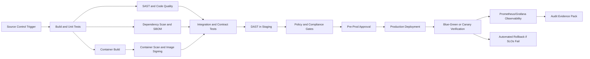

# NovaPay Digital Bank CI/CD Pipeline Architecture

## 1. Purpose

This document defines the production-grade CI/CD pipeline architecture for NovaPay Digital Bank, a fictional RBI-licensed digital bank moving from manual SSH-based production deployments to an automated, regulated, zero-downtime delivery model.

The objective is not to build a full banking application. The sample application, NovaPay Lite, is used only as a deployment and testing target to demonstrate build, packaging, scanning, deployment verification, database migration, observability, and evidence generation. The actual assessment deliverable is the CI/CD pipeline architecture and its compliance controls.

## 2. Current State

NovaPay Digital Bank currently operates with the following weaknesses:

* Manual SSH deployments to production.
* Fortnightly deployment cycle.
* 4.5-hour mean time to recovery.
* No automated SAST, DAST, dependency, or container scanning.
* No automated compliance gates.
* Manual database migrations during maintenance windows.
* Low deployment traceability.
* No complete audit evidence pack per production change.
* Open regulatory non-conformances from previous audit findings.

## 3. Target State

The target state is a regulated banking-grade delivery platform with:

* Commit-to-production time under two hours for standard changes.
* Five-nines availability target through blue-green and canary deployment.
* Automated rollback for high-severity production degradation.
* Automated security and compliance gates before production promotion.
* Full audit traceability from commit to production deployment.
* Same artefact promoted across dev, staging, pre-prod, and production.
* Expand-contract database migration pattern for zero-downtime schema changes.
* DORA and operational observability across the pipeline and runtime platform.

## 4. High-Level Pipeline Flow

## 5. Pipeline Stage Specifications

| Stage                                | Purpose                                            | Primary Tools                                        | Inputs                                    | Outputs                                 | Gate                                                    |
| ------------------------------------ | -------------------------------------------------- | ---------------------------------------------------- | ----------------------------------------- | --------------------------------------- | ------------------------------------------------------- |
| 1. Source Control and Trigger        | Enforce controlled change entry                    | GitHub Enterprise, branch protection, signed commits | Pull request, commit, tag                 | Verified change request                 | No direct main push, mandatory review, signed commit    |
| 2. Build and Compilation             | Produce reproducible artefact                      | GitHub Actions, Gradle, Docker BuildKit              | Source code, Gradle files                 | JAR, container image candidate          | Build success, unit tests pass, coverage target checked |
| 3. SAST and Code Quality             | Detect insecure code patterns                      | SonarQube or SonarCloud                              | Source code                               | SAST report, quality report             | 0 Critical, max 2 High, no new blocker issues           |
| 4. Dependency and Container Scanning | Detect vulnerable libraries and images             | Trivy, Syft, Grype                                   | JAR, image, lock files                    | SBOM, vulnerability report              | 0 Critical CVEs; High CVEs blocked if CVSS > 8.0        |
| 5. Integration and Contract Testing  | Validate service and API compatibility             | Testcontainers, Pact, OpenAPI checks                 | Built artefact, test environment          | Integration result, contract report     | 100% critical integration tests pass                    |
| 6. DAST                              | Detect runtime web/API vulnerabilities             | OWASP ZAP                                            | Running staging deployment, OpenAPI spec  | DAST report                             | 0 Critical/High OWASP Top 10 findings                   |
| 7. Policy and Compliance Gates       | Enforce banking, Kubernetes, and security controls | OPA, Kyverno, Checkov, Cosign                        | K8s manifests, Helm chart, image metadata | Policy decision, compliance evidence    | All mandatory policies pass                             |
| 8. Deployment and Verification       | Release safely with zero downtime                  | Helm, ArgoCD, Istio, Prometheus                      | Approved artefact and manifests           | Production release, verification report | Smoke tests pass, SLOs remain healthy                   |

## 6. Stage 1: Source Control and Trigger

NovaPay uses trunk-based development with short-lived feature branches. All changes enter through pull requests.

Mandatory controls:

* Direct pushes to main are blocked.
* Pull request approval is required.
* Signed commits are required.
* CODEOWNERS approval is required for security, infrastructure, database, and pipeline changes.
* Emergency hotfixes use a fast-track branch but do not bypass security and compliance gates.
* Every pipeline run generates a unique run ID linked to commit SHA, build artefact, image digest, and deployment record.

Evidence generated:

* Pull request approval record.
* Commit SHA.
* Signed commit verification status.
* Pipeline trigger event.
* Branch protection result.

## 7. Stage 2: Build and Compilation

The build stage compiles the Java 21 Spring Boot application, runs unit tests, and creates a reproducible artefact.

Recommended configuration:

* Java 21.
* Gradle wrapper pinned in repository.
* Dependency lock files enabled.
* Docker BuildKit enabled.
* Artefact version format: `MAJOR.MINOR.PATCH+gitsha.pipelineRunId.timestamp`.
* Container tags: semantic version and Git SHA.
* No production deployment using `latest`.

Quality expectations:

* Build must pass.
* Unit tests must pass.
* Line coverage target: 80%.
* Branch coverage target: 70%.
* Build duration target: under 10 minutes.

Evidence generated:

* Build log.
* Test result report.
* Coverage report.
* Artefact checksum.
* Container image digest.

## 8. Stage 3: Static Analysis and SAST

SAST detects insecure source-code patterns before artefacts move forward.

Controls:

* SonarQube quality profile for Java and Spring Boot.
* SQL injection checks.
* Unsafe deserialization checks.
* Hardcoded secret detection.
* PII logging detection.
* Weak cryptography detection.
* Technical debt limit for new code.

Gate thresholds:

* Critical findings: 0 allowed.
* High findings: maximum 2 allowed with mandatory ticket.
* New security hotspots: must be reviewed.
* New code coverage: minimum 80%.
* Duplicated code on new code: below 3%.

Failure handling:

* Pipeline stops.
* Ticket is created automatically.
* Developer receives remediation guidance.
* Exception requires CISO approval and expiry date.

Evidence generated:

* SAST report.
* Quality gate result.
* Remediation ticket reference.
* Exception approval record if applicable.

## 9. Stage 4: Dependency, SBOM, and Container Scanning

This stage validates software supply chain risk.

Controls:

* Trivy or Grype scans dependencies and container image.
* Syft generates SBOM in CycloneDX or SPDX format.
* Licence scan blocks prohibited licences.
* Base image provenance is verified.
* Image is signed using Cosign before promotion.

Gate thresholds:

* Critical CVEs: 0 allowed.
* High CVEs with CVSS above 8.0: blocked.
* Medium CVEs: ticket and SLA-based remediation.
* GPL, AGPL, and SSPL licences: blocked unless legal exception is approved.
* Unsigned image: blocked by admission policy.

Evidence generated:

* Trivy report.
* SBOM file.
* Licence report.
* Cosign signature.
* Image digest and provenance attestation.

## 10. Stage 5: Integration and Contract Testing

Integration testing confirms that the service works with its dependent infrastructure and APIs.

Scope:

* PostgreSQL migration and repository tests.
* Redis connectivity tests.
* RabbitMQ connectivity tests.
* API contract validation using OpenAPI/Pact.
* Backward compatibility checks.
* Idempotency tests for payment-like operations.
* Smoke tests for health, version, and metrics endpoints.

Gate thresholds:

* Critical integration tests: 100% pass.
* Contract breaking changes: blocked.
* OpenAPI incompatible changes: blocked unless versioned.
* Database migration validation: must pass.

Evidence generated:

* Test result summary.
* Contract test report.
* OpenAPI compatibility result.
* Database migration validation result.

## 11. Stage 6: DAST

DAST runs against a deployed staging environment.

Controls:

* OWASP ZAP baseline scan for every release candidate.
* Authenticated ZAP scan for protected APIs where feasible.
* OpenAPI-driven API scan.
* False-positive workflow with security review.

Gate thresholds:

* Critical findings: 0 allowed.
* High OWASP Top 10 findings: 0 allowed.
* Medium findings: ticket and remediation SLA.
* False positives require security-team approval.

Evidence generated:

* ZAP report.
* Finding severity summary.
* False-positive approval record.
* Remediation ticket references.

## 12. Stage 7: Policy and Compliance Gates

Policy and compliance gates convert regulatory and platform rules into automated controls.

Policy categories:

* Kubernetes workload security.
* Image signature verification.
* No `latest` image tag in production.
* Resource requests and limits required.
* Non-root containers required.
* No privileged containers.
* Required labels: owner, environment, compliance-scope, data-classification.
* TLS and mTLS required for production ingress/service mesh.
* Secrets must come from approved secret manager.
* Production deployment requires dual approval.

Compliance mapping:

| Control Area             | Automated Gate                                              |
| ------------------------ | ----------------------------------------------------------- |
| Change management        | PR approval, pipeline audit trail, deployment approval      |
| Segregation of duties    | Separate developer, release manager, and SRE approval roles |
| Vulnerability management | SAST, DAST, dependency, and container scan gates            |
| Audit logging            | Immutable pipeline evidence and deployment records          |
| Data protection          | TLS/mTLS, secret management, encryption policy              |
| Incident readiness       | Rollback automation and incident playbook                   |

Evidence generated:

* OPA/Kyverno policy result.
* Admission decision.
* Approval record.
* Change ticket.
* Compliance mapping report.

## 13. Stage 8: Deployment and Verification

Production deployment is executed through GitOps using ArgoCD and Helm. The same container image is promoted through all environments. Only configuration changes by environment.

Deployment methods:

* Blue-green for major releases and high-risk changes.
* Canary for incremental releases and low-to-medium risk changes.
* Rollback through traffic re-routing and previous stable deployment version.

Post-deployment verification:

* Health endpoint check.
* Version endpoint check.
* Prometheus metrics check.
* Synthetic transaction check.
* Image digest verification.
* Pod readiness verification.
* Error-rate and latency monitoring.
* Database migration compatibility verification.

Success criteria:

* Health checks pass.
* Error rate remains below threshold.
* p99 latency remains within baseline.
* No critical alerts fire.
* Synthetic transactions succeed.
* All pods run the expected image digest.

Evidence generated:

* Deployment log.
* Helm rendered manifest.
* ArgoCD sync result.
* Smoke test result.
* Metrics snapshot.
* Release approval record.

## 14. Parallelisation and SLA Target

To meet the under-two-hour commit-to-production target, the pipeline runs independent checks in parallel.

Recommended timing:

| Pipeline Area                        | Target Duration |
| ------------------------------------ | --------------: |
| Source validation                    |       2 minutes |
| Build and unit tests                 |      10 minutes |
| SAST                                 |      10 minutes |
| Dependency and container scan        |      10 minutes |
| Integration and contract tests       |      20 minutes |
| DAST                                 |      20 minutes |
| Policy and compliance gates          |       5 minutes |
| Pre-prod approval                    |      15 minutes |
| Production canary initial phase      |      15 minutes |
| Verification and evidence generation |       5 minutes |

Target total for standard change: under 120 minutes.

## 15. Failure Modes and Remediation

| Failure            | Pipeline Behaviour | Remediation                              |
| ------------------ | ------------------ | ---------------------------------------- |
| Build failure      | Stop pipeline      | Fix compile/config issue                 |
| Unit test failure  | Stop pipeline      | Fix tests or code                        |
| SAST critical      | Stop pipeline      | Remediate vulnerability                  |
| Critical CVE       | Stop promotion     | Upgrade dependency/base image            |
| DAST high finding  | Stop promotion     | Fix runtime vulnerability                |
| Policy violation   | Reject manifest    | Update Helm/K8s configuration            |
| Failed smoke test  | Auto-rollback      | Route traffic to previous stable version |
| Canary SLO failure | Auto-rollback      | Freeze release and open incident         |
| Migration failure  | Stop deployment    | Execute phase-specific rollback plan     |

## 16. Audit Evidence Model

Every release produces an evidence pack containing:

* Commit SHA and PR approval.
* Build log.
* Test report.
* Coverage report.
* SAST report.
* Dependency and container scan report.
* SBOM.
* Image signature and digest.
* DAST report.
* Policy gate report.
* Deployment manifest.
* Approval record.
* Smoke test results.
* Runtime metrics snapshot.
* Rollback result if applicable.
* Change ticket and release notes.

The evidence pack is stored in immutable object storage with retention aligned to banking audit requirements.

## 17. Relationship to Other Deliverables

This architecture document is the foundation for the remaining deliverables:

* Deployment strategies are detailed in `docs/02-deployment-strategies/deployment-strategies.md`.
* Compliance gates are detailed in `docs/03-compliance-gates/compliance-gates.md`.
* Database migration is detailed in `docs/04-database-migration/database-migration.md`.
* Environment promotion is detailed in `docs/05-environment-promotion/environment-promotion.md`.
* Rollback specification is detailed in `docs/06-rollback-specification/rollback-specification.md`.
* Runbooks are stored under `runbooks/`.
* Observability and DORA metrics are detailed in `docs/08-observability/observability.md`.

## 18. Local Evidence from NovaPay Lite

NovaPay Lite provides local evidence that the target application can be packaged, deployed, verified, and scanned.

Available evidence includes:

* Docker image build output.
* Docker image metadata.
* Docker Compose service status.
* Health endpoint response.
* Version endpoint response.
* Prometheus metrics output.
* OpenAPI runtime output.
* Customer API response.
* PostgreSQL database verification row.
* Helm lint result.
* Helm rendered manifest.
* Trivy image scan report.

The Trivy scan is intentionally treated as vulnerability evidence, not as a production approval. In a real NovaPay production pipeline, critical and high findings would block promotion until remediation or formal exception approval.
