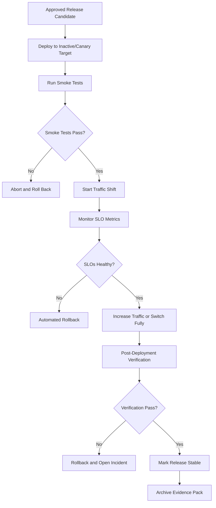
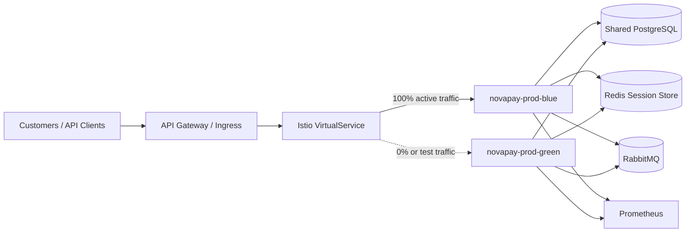
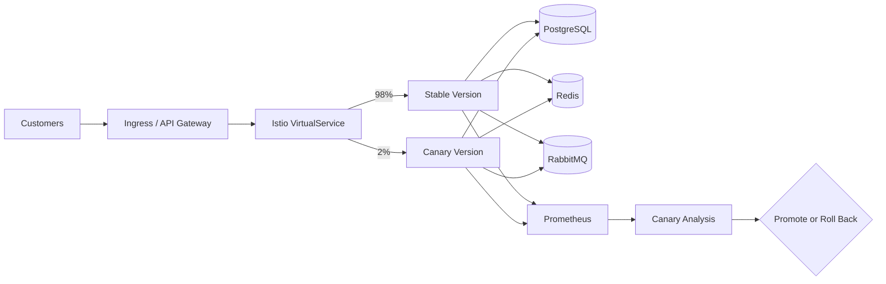

# NovaPay Digital Bank Deployment Strategies

## 1. Purpose

This document defines the zero-downtime deployment strategies for NovaPay Digital Bank’s regulated CI/CD platform.

NovaPay is moving away from manual SSH-based production deployments toward automated, controlled, observable, and reversible deployments. The deployment strategy must support five-nines availability, fast rollback, auditability, and compliance with banking-grade change-management expectations.

The two primary production deployment strategies are:

* Blue-green deployment.
* Canary deployment.

Both strategies are supported by automated verification, Prometheus-based health checks, service mesh traffic control, deployment evidence generation, and rollback automation.

## 2. Deployment Objectives

NovaPay’s deployment strategy must satisfy the following goals:

* Avoid customer-visible downtime during production releases.
* Reduce deployment blast radius.
* Detect failed releases before full rollout.
* Support automated rollback within defined SLO thresholds.
* Preserve customer sessions during traffic switching.
* Ensure database changes remain backward compatible.
* Generate audit-ready evidence for every deployment.
* Avoid deployment during banking blackout windows.
* Support commit-to-production target under two hours for normal changes.

## 3. Platform Assumptions

| Component           | Target Design                                                        |
| ------------------- | -------------------------------------------------------------------- |
| Runtime platform    | Kubernetes 1.29+                                                     |
| Deployment package  | Helm chart                                                           |
| GitOps controller   | ArgoCD                                                               |
| Traffic management  | Istio VirtualService or equivalent service mesh                      |
| Observability       | Prometheus, Grafana, Alertmanager, Loki, OpenTelemetry               |
| Session/cache layer | Redis 7 cluster                                                      |
| Database            | PostgreSQL 16                                                        |
| Message broker      | RabbitMQ 3.13                                                        |
| Rollback control    | ArgoCD rollback, Helm rollback, Istio traffic re-routing             |
| Evidence            | Pipeline logs, Helm manifests, metrics snapshots, smoke test results |

## 4. Strategy Selection Matrix

| Release Scenario              | Recommended Strategy            | Reason                                                     |
| ----------------------------- | ------------------------------- | ---------------------------------------------------------- |
| Low-risk patch release        | Canary                          | Limits blast radius and allows progressive validation      |
| High-risk application release | Blue-green                      | Allows full environment verification before traffic switch |
| Major dependency upgrade      | Blue-green                      | Easier full-stack validation before cutover                |
| Feature-flagged release       | Canary                          | Can combine traffic rollout with feature flag rollout      |
| Database expand phase         | Blue-green or canary            | Backward-compatible schema supports both versions          |
| Database contract phase       | Blue-green with manual approval | Contract is irreversible and requires stronger control     |
| Emergency hotfix              | Canary fast-track or blue-green | Must still pass mandatory gates                            |
| Infrastructure routing change | Canary                          | Configuration changes must be progressively tested         |

## 5. High-Level Deployment Flow



## 6. Blue-Green Deployment Strategy

### 6.1 Concept

Blue-green deployment maintains two production-capable environments:

* Blue environment: currently serving live traffic.
* Green environment: receives the new version and is verified before traffic cutover.

Only one environment receives customer traffic at a time. Traffic switching happens through the load balancer, ingress controller, or service mesh routing rule.

### 6.2 NovaPay Blue-Green Topology



### 6.3 Namespace Model

| Namespace               | Purpose                                             |
| ----------------------- | --------------------------------------------------- |
| `novapay-prod-blue`     | One complete production environment                 |
| `novapay-prod-green`    | Second complete production environment              |
| `novapay-shared`        | PostgreSQL, Redis, RabbitMQ, shared infrastructure  |
| `novapay-observability` | Prometheus, Grafana, Loki, Alertmanager             |
| `novapay-security`      | OPA/Kyverno, policy controllers, image verification |

## 7. Blue-Green Deployment Sequence

### Step 1: Identify Active Environment

The pipeline checks the current production route.

Example:

```text id="30cfwy"
active_environment = blue
inactive_environment = green
```

### Step 2: Deploy New Version to Inactive Environment

The new image is deployed to the inactive environment only.

Controls:

* Helm upgrade runs against inactive namespace.
* Image digest is pinned.
* Config uses production values.
* Secrets are pulled from approved secret manager.
* Database migration must already be in compatible state.

### Step 3: Run Pre-Traffic Verification

Verification before customer traffic:

* Kubernetes rollout status.
* Pod readiness.
* Health endpoint.
* Version endpoint.
* Prometheus metrics endpoint.
* Synthetic transaction against internal route.
* Database connectivity.
* Redis connectivity.
* RabbitMQ connectivity.
* Log ingestion check.

### Step 4: Start Connection Draining

Before traffic switch:

* Active environment stops receiving new connections.
* In-flight HTTP requests are allowed to finish.
* Payment-like long-running jobs are drained.
* RabbitMQ consumers are paused or scaled down carefully if needed.
* Maximum HTTP drain time: 60 seconds.
* Maximum payment/job drain time: 5 minutes.

### Step 5: Atomic Traffic Switch

Traffic is switched from blue to green using service mesh routing.

Example desired state:

```text id="hmsp9k"
Before:
blue = 100%
green = 0%

After:
blue = 0%
green = 100%
```

### Step 6: Post-Switch Verification

After switch:

* Smoke tests run against public route.
* Synthetic transactions run.
* Error rate and latency are compared with baseline.
* Alertmanager checks for critical alerts.
* SRE confirms dashboards are healthy.

### Step 7: Mark Release Stable

If verification passes:

* New environment becomes active.
* Previous environment remains warm for rollback.
* Evidence pack is finalized.
* Release is marked stable after bake period.

### Step 8: Decommission Old Version Later

The previous environment is not immediately deleted. It is retained for fast rollback until the bake period ends.

Recommended bake period:

```text id="wrnfdw"
Standard release: 2 hours
High-risk release: 24 hours
Major release: 24-48 hours
```

## 8. Blue-Green Success Criteria

| Check                    | Success Criteria                |
| ------------------------ | ------------------------------- |
| Kubernetes rollout       | All pods ready                  |
| Health endpoint          | 100% success                    |
| Version endpoint         | Expected image/version returned |
| Synthetic transaction    | 100% pass for critical journeys |
| HTTP 5xx rate            | Below 0.1% during verification  |
| p99 latency              | Less than 2x baseline           |
| Error budget burn        | No abnormal burn                |
| Database connection pool | No exhaustion                   |
| Redis session continuity | No mass session loss            |
| RabbitMQ queue depth     | No abnormal backlog             |
| Critical alerts          | 0 active                        |

## 9. Blue-Green Rollback

Blue-green rollback is traffic re-routing to the previous stable environment.

Rollback sequence:

1. Detect failed verification or SLO breach.
2. Freeze further deployment.
3. Route traffic back to previous environment.
4. Confirm previous environment health.
5. Run smoke tests.
6. Notify SRE, Release Manager, and incident channel.
7. Preserve logs and metrics.
8. Open incident or deployment failure record.

Target rollback time:

```text id="30iz5i"
Immediate rollback: under 60 seconds after trigger
Full verification after rollback: under 5 minutes
```

## 10. Canary Deployment Strategy

### 10.1 Concept

Canary deployment gradually sends a small percentage of production traffic to the new version. The rollout continues only if metrics remain healthy.

This strategy reduces blast radius and allows real production validation without exposing all customers at once.

### 10.2 NovaPay Canary Topology



## 11. Canary Rollout Phases

| Phase                   | Traffic |     Duration | Success Criteria                                          | Action                         |
| ----------------------- | ------: | -----------: | --------------------------------------------------------- | ------------------------------ |
| Phase 1: Initial Canary |    1-2% |   15 minutes | Error rate < 0.1%, p99 latency < 200ms or within baseline | Promote to Phase 2 or rollback |
| Phase 2: Early Adopter  |   5-10% |   30 minutes | Error rate < 0.05%, no critical alerts                    | Promote or rollback            |
| Phase 3: Expansion      |  25-50% |   60 minutes | All SLOs healthy, no degradation vs baseline              | Promote or rollback            |
| Phase 4: Full Rollout   |    100% | 24-hour bake | SLO compliance maintained                                 | Mark stable                    |

## 12. Canary Metrics

Canary analysis uses both technical and business metrics.

### Technical Metrics

| Metric                   | Threshold                                 |
| ------------------------ | ----------------------------------------- |
| HTTP 5xx rate            | Immediate rollback if > 5% for 60 seconds |
| HTTP 4xx anomaly         | Alert if > 2x baseline                    |
| p99 latency              | Rollback if > 2x baseline for 5 minutes   |
| CPU usage                | Alert if > 90% for 5 minutes              |
| Memory usage             | Alert if > 85% for 5 minutes              |
| Pod restarts             | Rollback if repeated restarts occur       |
| CrashLoopBackOff         | Immediate rollback                        |
| DB connection pool usage | Rollback if exhausted                     |
| RabbitMQ queue depth     | Alert if > 1000 messages sustained        |

### Banking and Business Metrics

| Metric                     | Threshold                             |
| -------------------------- | ------------------------------------- |
| Transaction success rate   | Rollback if drops > 2% below baseline |
| Payment timeout rate       | Rollback if exceeds baseline by 2x    |
| Failed customer onboarding | Alert if above baseline               |
| API availability           | Must remain above SLO                 |
| Synthetic payment journey  | 100% critical smoke pass              |

## 13. Statistical Canary Analysis

Canary promotion must not rely only on simple averages. NovaPay uses statistical comparison between stable and canary traffic.

Recommended analysis:

* Compare p95/p99 latency between stable and canary.
* Compare error proportions between stable and canary.
* Use rolling 7-day production baseline.
* Use confidence interval based promotion checks.
* Block promotion if canary degradation is statistically significant.

Decision logic:

```text id="pjwo2j"
Promote if:
- canary error rate is within threshold
- canary latency is within threshold
- no critical alerts exist
- transaction success rate is healthy
- synthetic checks pass
- policy and evidence gates are complete

Rollback if:
- immediate rollback trigger fires
- canary health score falls below threshold
- canary degrades significantly compared to stable
```

## 14. Canary Health Score

NovaPay uses a weighted health score for automated rollout decisions.

| Category            | Weight |
| ------------------- | -----: |
| Error rate          |    30% |
| Latency             |    25% |
| Transaction success |    25% |
| Resource saturation |    10% |
| Synthetic checks    |    10% |

Health decision:

|    Score | Action                        |
| -------: | ----------------------------- |
|   95-100 | Promote automatically         |
|    85-94 | Hold and continue observation |
|    70-84 | Alert SRE and pause rollout   |
| Below 70 | Roll back automatically       |

## 15. Session Management

NovaPay uses Redis-backed distributed sessions to avoid session loss during blue-green or canary traffic movement.

Requirements:

* Sessions must not be stored only in pod memory.
* Redis must be shared across active deployment versions.
* Session schema must be backward compatible.
* Session TTL must be consistent across versions.
* Login/authentication changes require additional canary validation.
* Sticky sessions are avoided unless technically required.

Failure handling:

* Redis failure triggers degraded-mode alert.
* Session deserialization errors trigger rollback if above threshold.
* Authentication failure spike triggers rollout pause.

## 16. Database Compatibility During Deployment

Both blue-green and canary require database backward compatibility.

NovaPay follows the expand-contract pattern:

1. Expand: add new nullable columns/tables/indexes without breaking old version.
2. Migrate: backfill data using throttled and idempotent jobs.
3. Contract: remove old schema only after all services use the new schema.

Compatibility rule:

| App Version    | Expand Schema | Migrated Schema | Contract Schema |
| -------------- | ------------- | --------------- | --------------- |
| V(N-1) old app | Must work     | Must work       | May fail        |
| V(N) new app   | Must work     | Must work       | Must work       |

Therefore:

* Contract phase is never deployed together with application rollout.
* Contract phase requires separate approval.
* Contract phase requires rollback impact review.
* Canary and blue-green are allowed only when schema is backward compatible.

## 17. Message and Job Draining

NovaPay uses RabbitMQ for asynchronous processing. Deployment must avoid duplicate or lost processing.

Controls:

* Consumers receive termination notice.
* Pod termination grace period is configured.
* Consumers stop accepting new messages before shutdown.
* In-flight messages are acknowledged only after successful processing.
* Failed in-flight messages are requeued safely.
* Idempotency keys protect payment-like operations from duplicate processing.

Recommended settings:

| Control                             | Target                                 |
| ----------------------------------- | -------------------------------------- |
| HTTP drain timeout                  | 30-60 seconds                          |
| Payment/job drain timeout           | Up to 5 minutes                        |
| Kubernetes termination grace period | 60-300 seconds                         |
| RabbitMQ prefetch                   | Tuned to avoid large in-flight backlog |
| Idempotency key retention           | Minimum 24 hours                       |

## 18. Deployment Blackout Windows

Production deployment is blocked during high-risk business periods unless an emergency approval is granted.

Blackout windows:

* Salary days: 1st, 7th, and 15th of each month.
* Month-end processing: 28th to 31st.
* Major Indian festivals such as Diwali, Holi, Eid, Christmas.
* RBI settlement or regulatory filing windows.
* Planned marketing campaign traffic windows.
* Peak UPI/payment usage windows: 10 AM-12 PM and 5 PM-8 PM IST.
* Active SEV-1 or SEV-2 incident.

Pipeline check:

```text id="xeqer1"
if current_time in blackout_window:
    block production deployment
    require emergency approval for override
```

## 19. Automated Rollback Triggers

### Category A: Immediate Rollback

Target response: under 60 seconds.

| Trigger                                | Threshold                            |
| -------------------------------------- | ------------------------------------ |
| HTTP 5xx rate                          | > 5% for 60 seconds                  |
| Health check failure                   | 3 consecutive failures               |
| CrashLoopBackOff                       | Any production release pod           |
| OOMKilled                              | Any canary or new release pod        |
| DB connection pool exhaustion          | Immediate                            |
| Synthetic critical transaction failure | Repeated failure during verification |

### Category B: Escalated Rollback

Target response: under 15 minutes.

| Trigger                  | Threshold                          |
| ------------------------ | ---------------------------------- |
| p99 latency              | > 2x baseline for 5 minutes        |
| Error budget burn        | > 10x normal for 10 minutes        |
| Transaction success rate | Drops > 2% below baseline          |
| CPU saturation           | > 90% for 5 minutes                |
| Memory saturation        | > 85% for 5 minutes                |
| Queue depth              | > 1000 sustained with consumer lag |

### Category C: Manual Decision

Requires human judgment.

Examples:

* Gradual performance degradation.
* Customer support reports.
* Compliance anomaly discovered after deployment.
* External payment gateway instability.
* Partial regional degradation.
* Downstream dependency issue.

## 20. Deployment Verification Checklist

Before marking deployment successful, the pipeline verifies:

* Expected image digest is running.
* All pods are ready.
* No unexpected pod restarts.
* Health endpoint returns success.
* Version endpoint reports expected release.
* Prometheus metrics endpoint is available.
* Synthetic customer journey succeeds.
* Synthetic transaction journey succeeds.
* Database migration version is correct.
* Redis connectivity is healthy.
* RabbitMQ queue depth is normal.
* Error rate remains below threshold.
* p99 latency remains within threshold.
* No critical alerts are active.
* Evidence files are archived.

## 21. Evidence Generated Per Deployment

Each deployment produces an evidence pack:

* Release version.
* Commit SHA.
* Image digest.
* Helm rendered manifest.
* ArgoCD sync status.
* Deployment strategy selected.
* Traffic shifting log.
* Smoke test results.
* Synthetic transaction results.
* Prometheus metrics snapshot.
* Alertmanager status.
* Rollback decision record.
* Approval record.
* Change ticket reference.
* Post-deployment verification summary.

## 22. Blue-Green Example Traffic Manifest

Example Istio-style traffic switch concept:

```yaml id="fc50h7"
apiVersion: networking.istio.io/v1beta1
kind: VirtualService
metadata:
  name: novapay-api
  namespace: novapay-prod
spec:
  hosts:
    - api.novapay.example
  http:
    - route:
        - destination:
            host: novapay-api-blue
          weight: 100
        - destination:
            host: novapay-api-green
          weight: 0
```

After cutover:

```yaml id="9tucku"
apiVersion: networking.istio.io/v1beta1
kind: VirtualService
metadata:
  name: novapay-api
  namespace: novapay-prod
spec:
  hosts:
    - api.novapay.example
  http:
    - route:
        - destination:
            host: novapay-api-blue
          weight: 0
        - destination:
            host: novapay-api-green
          weight: 100
```

## 23. Canary Example Traffic Manifest

```yaml id="ckhal1"
apiVersion: networking.istio.io/v1beta1
kind: VirtualService
metadata:
  name: novapay-api
  namespace: novapay-prod
spec:
  hosts:
    - api.novapay.example
  http:
    - route:
        - destination:
            host: novapay-api-stable
          weight: 98
        - destination:
            host: novapay-api-canary
          weight: 2
```

## 24. Local NovaPay Lite Evidence Mapping

NovaPay Lite is used only as a sample deployment target. The local evidence demonstrates the mechanics that the production pipeline would automate.

| Evidence File               | Purpose                                    |
| --------------------------- | ------------------------------------------ |
| `docker-build.txt`          | Shows application image can be built       |
| `docker-image-inspect.json` | Captures image metadata                    |
| `trivy-image-report.txt`    | Shows container/dependency scan output     |
| `docker-compose-ps.txt`     | Shows runtime services                     |
| `health-endpoint.txt`       | Demonstrates health verification           |
| `version-endpoint.json`     | Demonstrates release identity endpoint     |
| `prometheus-metrics.txt`    | Demonstrates observability endpoint        |
| `customer-api-response.txt` | Demonstrates API smoke test                |
| `customer-db-row.txt`       | Demonstrates database persistence          |
| `helm-lint.txt`             | Demonstrates Helm chart validation         |
| `helm-rendered.yaml`        | Demonstrates deployment manifest rendering |

## 25. Conclusion

NovaPay’s deployment strategy combines blue-green and canary releases to meet regulated banking expectations for availability, traceability, and risk control.

Blue-green deployment provides safe full-environment cutover with fast traffic rollback. Canary deployment provides progressive exposure with automated metric-based promotion or rollback. Both strategies depend on backward-compatible database migrations, Redis-backed session continuity, message draining, observability, deployment verification, and audit evidence generation.

This deployment design allows NovaPay to move from manual high-risk releases to controlled, observable, zero-downtime production delivery.
