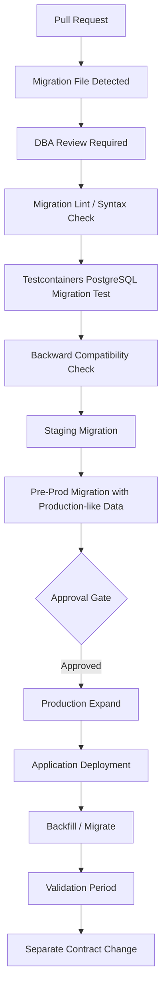

# NovaPay Digital Bank Zero-Downtime Database Migration Strategy

## 1. Purpose

This document defines the zero-downtime database migration strategy for NovaPay Digital Bank’s regulated CI/CD pipeline.

Database changes are among the highest-risk parts of banking deployments. A failed application release can usually be rolled back quickly through blue-green or canary traffic routing, but a destructive database migration can cause irreversible data loss, customer impact, payment failure, regulatory issues, and extended recovery time.

NovaPay therefore uses the expand-contract migration pattern for all production database changes.

## 2. Scope

This strategy applies to:

* PostgreSQL 16 schema migrations.
* Application database changes.
* Financial tables with high row counts.
* Customer, account, transaction, payment, audit, and ledger-style tables.
* Backward-compatible application releases.
* Blue-green and canary deployments.
* Production migration approval, verification, and rollback.

NovaPay Lite uses Flyway migrations as local demonstration evidence. In production, NovaPay may use Flyway for controlled versioning and pgroll or equivalent online migration tooling for high-risk PostgreSQL schema changes.

## 3. Database Migration Principles

NovaPay follows these principles:

* No production maintenance window for routine schema changes.
* No direct manual schema changes through SSH or ad-hoc SQL.
* Every migration is versioned, reviewed, tested, and approved.
* Every migration has a rollback or mitigation plan.
* Schema changes must be backward compatible until all application versions are migrated.
* Destructive changes are separated from application deployment.
* The same migration script must be tested in staging and pre-production before production.
* Migration execution must be observable through metrics, logs, and audit records.
* Migrations must be idempotent where possible.
* Long-running backfills must be throttled and resumable.
* Contract operations require separate approval.

## 4. Expand-Contract Overview

The expand-contract pattern splits a database change into three controlled phases.


### Phase 1: Expand

Add new schema elements without breaking the old application.

Examples:

* Add nullable column.
* Add new table.
* Add new index concurrently.
* Add new foreign key in non-blocking mode.
* Add new view.
* Add new status field while keeping old field.

The old and new application versions must both work with this schema.

### Phase 2: Migrate

Move or backfill data into the new schema.

Examples:

* Copy values from old column to new column.
* Backfill encrypted or tokenized data.
* Populate new lookup table.
* Dual-write old and new fields during transition.
* Validate row counts and checksums.

The migration must be resumable and throttled.

### Phase 3: Contract

Remove old schema elements only after all application versions use the new schema.

Examples:

* Drop old column.
* Drop old table.
* Remove old index.
* Remove legacy trigger.
* Remove compatibility view.

Contract is the riskiest phase and must be handled as a separate production change.

## 5. Compatibility Matrix

| Schema State                 | App V(N-1) Old Version                   | App V(N) New Version | Deployment Safety               |
| ---------------------------- | ---------------------------------------- | -------------------- | ------------------------------- |
| Original schema              | Works                                    | May not work         | Safe only for old app           |
| Expanded schema              | Works                                    | Works                | Safe for blue-green and canary  |
| Expanded + backfilled schema | Works                                    | Works                | Safe for traffic migration      |
| New app dual-write enabled   | Works if backward compatibility retained | Works                | Safe with monitoring            |
| Contracted schema            | Fails if old app needs old fields        | Works                | Safe only after old app removed |

Key rule:

> Blue-green and canary deployments are allowed only when both old and new application versions can run against the same database schema.

## 6. Migration Governance

Every production database migration requires governance controls.

| Change Type                    | Required Approval                          |
| ------------------------------ | ------------------------------------------ |
| Add nullable column            | Peer review + DBA review                   |
| Add index concurrently         | DBA review                                 |
| Add new table                  | DBA review                                 |
| Backfill job                   | DBA + SRE review                           |
| Add constraint                 | DBA review + performance validation        |
| Drop column/table              | DBA + Release Manager + SRE Lead approval  |
| Change data type               | DBA + architecture review                  |
| Payment/ledger table migration | DBA + Compliance Owner + SRE Lead approval |
| Contract phase                 | CAB or formal change approval              |

## 7. Migration Review Checklist

Before a migration can be approved, reviewers verify:

* Migration follows expand-contract.
* Migration is backward compatible.
* Rollback plan is documented.
* Script was tested in staging.
* Script was tested in pre-production with production-like data volume.
* Query plan impact is reviewed.
* Locking behaviour is understood.
* Long-running operations are throttled.
* Indexes use non-blocking creation where supported.
* Contract phase is separated from expand phase.
* Data validation queries are documented.
* Monitoring and alert thresholds are defined.
* On-call engineer and DBA are available during production execution.
* Deployment is outside blackout window.

## 8. Tooling Strategy

| Purpose                          | Tool                                              |
| -------------------------------- | ------------------------------------------------- |
| Versioned schema migrations      | Flyway                                            |
| Online PostgreSQL schema changes | pgroll or controlled PostgreSQL online operations |
| CI migration validation          | Testcontainers PostgreSQL                         |
| Performance validation           | EXPLAIN ANALYZE, pg_stat_statements               |
| Metrics                          | Prometheus PostgreSQL exporter                    |
| Logs                             | Loki or centralized logging                       |
| Approval evidence                | Change ticket and pipeline audit record           |
| Rollback tracking                | Runbook and incident/change record                |

## 9. PostgreSQL Online Migration Guidelines

NovaPay uses PostgreSQL-safe migration practices.

### 9.1 Adding Columns

Safe pattern:

```sql id="xzny6k"
ALTER TABLE customers
ADD COLUMN encrypted_email VARCHAR(512);
```

Avoid adding a non-null column with a default value directly to a huge table if it may rewrite data or create lock risk.

Safer pattern:

```sql id="icbkyq"
ALTER TABLE customers
ADD COLUMN risk_score INTEGER;

-- Backfill separately in batches.

ALTER TABLE customers
ALTER COLUMN risk_score SET DEFAULT 0;

-- Add NOT NULL only after validation.
ALTER TABLE customers
ALTER COLUMN risk_score SET NOT NULL;
```

### 9.2 Adding Indexes

Use concurrent index creation for production-sized tables:

```sql id="92vp92"
CREATE INDEX CONCURRENTLY idx_payments_created_at
ON payments(created_at);
```

Avoid:

```sql id="k7596p"
CREATE INDEX idx_payments_created_at
ON payments(created_at);
```

because it may block writes on large tables.

### 9.3 Adding Constraints

Use staged validation:

```sql id="8eec3m"
ALTER TABLE payments
ADD CONSTRAINT payments_amount_positive
CHECK (amount > 0) NOT VALID;

ALTER TABLE payments
VALIDATE CONSTRAINT payments_amount_positive;
```

### 9.4 Dropping Columns

Dropping columns is contract-phase work only.

```sql id="41h7gy"
ALTER TABLE customers
DROP COLUMN legacy_email;
```

This is never bundled with the application deployment that introduces the new column.

## 10. Example Migration: Customer Email Encryption

### Business Requirement

NovaPay wants to move from storing plain customer email to storing encrypted email.

Current table:

```text id="iu600y"
customers(id, first_name, last_name, email, created_at)
```

Target table:

```text id="q5q9f4"
customers(id, first_name, last_name, email, encrypted_email, created_at)
```

Long-term future state may remove or mask plain email, but only after validation and approval.

## 11. Phase 1: Expand

Add a new nullable column.

```sql id="bbfeha"
ALTER TABLE customers
ADD COLUMN encrypted_email VARCHAR(512);
```

Application compatibility:

| Application Version | Behaviour                                 |
| ------------------- | ----------------------------------------- |
| Old app             | Ignores `encrypted_email`                 |
| New app             | Writes both `email` and `encrypted_email` |
| Rollback to old app | Safe because old app still uses `email`   |

Validation:

```sql id="yuqi8j"
SELECT column_name
FROM information_schema.columns
WHERE table_name = 'customers'
AND column_name = 'encrypted_email';
```

Rollback for expand phase:

```sql id="4jlsmk"
ALTER TABLE customers
DROP COLUMN encrypted_email;
```

Rollback is allowed only if no production data depends on the new column.

## 12. Phase 2: Migrate / Backfill

Backfill existing customer rows in batches.

Pseudo logic:

```text id="3qdzqm"
while rows remain where encrypted_email is null:
    select next batch of 1000 rows
    encrypt email
    update encrypted_email
    sleep 100-500ms
    record progress checkpoint
```

Example SQL batch pattern:

```sql id="fj41p8"
UPDATE customers
SET encrypted_email = 'ENCRYPTED_' || email
WHERE id IN (
    SELECT id
    FROM customers
    WHERE encrypted_email IS NULL
    ORDER BY id
    LIMIT 1000
);
```

Production implementation should use proper encryption service or database-approved encryption logic. The above is only a simplified illustration.

Backfill controls:

* Batch size starts at 1,000 rows.
* Batch size may be increased only if latency remains healthy.
* Sleep interval between batches: 100-500ms.
* Backfill job records last processed ID.
* Job is idempotent.
* Job can resume after interruption.
* Job pauses automatically if latency or database load exceeds threshold.

Validation queries:

```sql id="q0cszx"
SELECT COUNT(*) AS total_customers
FROM customers;

SELECT COUNT(*) AS missing_encrypted_email
FROM customers
WHERE encrypted_email IS NULL;

SELECT COUNT(*) AS migrated_customers
FROM customers
WHERE encrypted_email IS NOT NULL;
```

## 13. Phase 3: Application Cutover

After backfill:

* New application reads from `encrypted_email`.
* New application continues writing both fields for a compatibility period.
* Canary deployment validates new read path.
* Blue-green deployment may be used for higher-risk cutover.
* Error rate, latency, and data mismatch metrics are monitored.

Compatibility period:

```text id="l0el5m"
Minimum: 24 hours
High-risk tables: 7 days
Payment/ledger data: custom approval required
```

## 14. Phase 4: Contract

Only after all application instances use the new field and rollback to the old app is no longer required, the old field may be removed or masked.

Contract approval requirements:

* DBA approval.
* Release Manager approval.
* SRE Lead approval.
* Compliance owner approval if PII or payment data is involved.
* Evidence that no application version reads the old field.
* Evidence that backups and recovery plans are available.
* Evidence that contract was tested in pre-production.

Example contract operation:

```sql id="lbyja4"
ALTER TABLE customers
DROP COLUMN email;
```

In practice, NovaPay may choose not to drop plain email immediately. It may instead mask, tokenize, or retain with restricted access depending on regulatory and business requirements.

## 15. Handling 100M+ Row Financial Tables

Large financial tables require special controls.

Examples:

* `payments`
* `transactions`
* `ledger_entries`
* `account_balances`
* `audit_events`

For 100M+ row tables:

* Avoid full-table locks.
* Avoid unbounded updates.
* Avoid large single transactions.
* Use indexed pagination.
* Use batch checkpoints.
* Use off-peak throttling.
* Monitor replication lag.
* Monitor WAL growth.
* Monitor query latency.
* Monitor connection pool usage.
* Provide emergency pause and resume controls.

Recommended batch approach:

| Parameter                    | Initial Value |
| ---------------------------- | ------------: |
| Batch size                   |    1,000 rows |
| Maximum batch size           |   10,000 rows |
| Sleep between batches        |     100-500ms |
| Max transaction duration     |     5 seconds |
| Max allowed latency increase |           20% |
| Max allowed replication lag  |    30 seconds |
| Max DB CPU during migration  |           70% |
| Max connection pool usage    |           80% |

## 16. Backfill Job Design

Backfill jobs must be safe and resumable.

Required properties:

* Idempotent update logic.
* Checkpoint table.
* Batch-level logging.
* Retry with exponential backoff.
* Dead-letter handling for failed rows.
* Pause/resume support.
* Maximum runtime limit.
* Metrics exposed to Prometheus.

Example checkpoint table:

```sql id="o17fza"
CREATE TABLE migration_checkpoints (
    migration_id VARCHAR(100) PRIMARY KEY,
    last_processed_id BIGINT,
    processed_rows BIGINT,
    failed_rows BIGINT,
    status VARCHAR(30),
    updated_at TIMESTAMP
);
```

Example checkpoint update:

```sql id="am6r1b"
UPDATE migration_checkpoints
SET last_processed_id = 500000,
    processed_rows = 500000,
    status = 'RUNNING',
    updated_at = now()
WHERE migration_id = 'customer-email-encryption-v1';
```

## 17. Migration Observability

Each migration exposes operational metrics.

| Metric                                   | Purpose                       |
| ---------------------------------------- | ----------------------------- |
| `migration_rows_processed_total`         | Number of migrated rows       |
| `migration_rows_failed_total`            | Number of failed rows         |
| `migration_batch_duration_seconds`       | Batch processing duration     |
| `migration_lag_seconds`                  | Delay in migration progress   |
| `database_query_latency_p99`             | Production query impact       |
| `database_cpu_usage_percent`             | Database saturation           |
| `database_connection_pool_usage_percent` | Connection pool pressure      |
| `postgres_replication_lag_seconds`       | Replication health            |
| `migration_current_batch_size`           | Active throttle size          |
| `migration_pause_events_total`           | Auto-pauses due to thresholds |

## 18. Abort and Pause Criteria

Migration pauses automatically if any of the following occur:

| Condition                                    | Action                              |
| -------------------------------------------- | ----------------------------------- |
| p99 query latency increases by more than 20% | Pause migration and alert DBA       |
| Database CPU exceeds 70% for 5 minutes       | Pause migration                     |
| Connection pool usage exceeds 80%            | Pause migration                     |
| Replication lag exceeds 30 seconds           | Pause migration                     |
| Deadlocks detected repeatedly                | Pause migration                     |
| Error rate exceeds threshold                 | Pause migration and investigate     |
| Payment success rate drops more than 2%      | Immediate pause and incident review |
| Customer-facing latency breaches SLO         | Pause and escalate                  |

Migration aborts if:

* Data corruption is detected.
* Repeated batch failures continue after retry.
* Critical production incident begins.
* DBA or SRE Lead manually aborts.
* Rollback or mitigation plan must be executed.

## 19. Rollback Strategy by Phase

| Phase               | Rollback Strategy                                              |
| ------------------- | -------------------------------------------------------------- |
| Expand              | Drop newly added column/table if unused                        |
| Migrate/backfill    | Pause job, fix issue, resume from checkpoint                   |
| Application cutover | Roll traffic back to previous app version                      |
| Dual-write phase    | Continue old path while fixing new path                        |
| Contract            | Usually forward-only; restore requires backup or new migration |

Important rule:

> Contract phase is not treated as easily reversible. It must be separately approved, tested, and backed by recovery planning.

## 20. Rollback Examples

### Expand Rollback

```sql id="7jm95e"
ALTER TABLE customers
DROP COLUMN encrypted_email;
```

Allowed only if no application depends on the column.

### Backfill Rollback

Backfill is usually not rolled back row-by-row. Instead:

* Pause backfill.
* Fix failed rows.
* Resume from checkpoint.
* If new values are wrong, run corrective migration.
* Preserve original data until validation completes.

### Application Rollback

If the new app fails:

* Route traffic back to stable blue/green environment.
* Keep expanded schema.
* Keep old columns/tables available.
* Investigate failure.
* Redeploy fixed version.

### Contract Rollback

If contract fails:

* Restore from backup if data was physically removed.
* Or deploy forward-fix migration.
* Or reintroduce compatibility column/table if possible.

Contract changes require stronger governance because rollback is not always simple.

## 21. CI/CD Integration

Database migration is integrated into the pipeline.



Pipeline checks:

* Migration naming convention.
* SQL syntax validation.
* Flyway validation.
* Rollback script or mitigation plan exists.
* Compatibility test passes.
* DBA approval present.
* Pre-production migration completed.
* Performance impact within threshold.

## 22. Migration Naming Convention

Flyway-style naming:

```text id="9tzgm5"
V001__initial_schema.sql
V002__add_customer_encrypted_email_expand.sql
V003__backfill_customer_encrypted_email.sql
V004__contract_remove_legacy_customer_email.sql
```

Naming rules:

* File name must describe phase: expand, migrate, contract.
* Contract migrations must not be bundled with expand.
* Payment/ledger migrations must include ticket number.
* Irreversible migrations must be clearly marked.

Example:

```text id="hwq1j6"
V025__EXPAND_add_payment_settlement_reference.sql
V026__MIGRATE_backfill_payment_settlement_reference.sql
V027__CONTRACT_drop_legacy_settlement_reference.sql
```

## 23. Database Change Risk Classification

| Risk Level | Example                      | Approval                               |
| ---------- | ---------------------------- | -------------------------------------- |
| Low        | Add nullable column          | Peer + DBA                             |
| Medium     | Add concurrent index         | DBA + SRE                              |
| High       | Backfill millions of rows    | DBA + SRE Lead                         |
| Very High  | Payment/ledger schema change | DBA + SRE Lead + Compliance            |
| Critical   | Drop column/table            | CAB + Release Manager + DBA + SRE Lead |

## 24. Production Execution Runbook

Before migration:

1. Confirm change ticket approved.
2. Confirm migration phase.
3. Confirm deployment is outside blackout window.
4. Confirm backup and restore point.
5. Confirm DBA and SRE on-call availability.
6. Confirm monitoring dashboard is open.
7. Confirm rollback or pause command.
8. Confirm application compatibility.
9. Confirm customer-impact communication plan.
10. Start migration.

During migration:

1. Monitor batch duration.
2. Monitor p99 database latency.
3. Monitor application error rate.
4. Monitor payment success rate.
5. Monitor connection pool.
6. Monitor replication lag.
7. Pause if thresholds are breached.
8. Record progress every 15 minutes.

After migration:

1. Run validation queries.
2. Verify application health.
3. Verify synthetic transactions.
4. Verify error rate and latency.
5. Archive logs and metrics.
6. Update change ticket.
7. Attach evidence to release pack.

## 25. Production Validation Queries

Example validation for customer email encryption:

```sql id="oqpozz"
SELECT COUNT(*) AS total_customers
FROM customers;

SELECT COUNT(*) AS missing_encrypted_email
FROM customers
WHERE encrypted_email IS NULL;

SELECT COUNT(*) AS customers_with_encrypted_email
FROM customers
WHERE encrypted_email IS NOT NULL;
```

Example validation for payments:

```sql id="p6sv8z"
SELECT status, COUNT(*)
FROM payments
GROUP BY status;

SELECT COUNT(*)
FROM payments
WHERE created_at >= now() - interval '15 minutes';
```

Example data consistency check:

```sql id="cpyptk"
SELECT COUNT(*)
FROM customers
WHERE email IS NOT NULL
AND encrypted_email IS NULL;
```

## 26. Audit Evidence

Every database migration produces evidence.

Evidence includes:

* Migration file name and checksum.
* Migration phase: expand, migrate, or contract.
* Pull request approval.
* DBA approval.
* Change ticket.
* Pipeline run ID.
* Environment where migration ran.
* Start timestamp.
* End timestamp.
* Row count before and after.
* Validation query output.
* Performance metrics snapshot.
* Lock/latency observations.
* Rollback or pause events.
* Final migration status.
* Approver identities.
* Exception record if applicable.

## 27. Local NovaPay Lite Evidence Mapping

NovaPay Lite demonstrates database migration concepts through Flyway and PostgreSQL.

Relevant local evidence:

| Evidence                          | Purpose                                          |
| --------------------------------- | ------------------------------------------------ |
| Docker Compose PostgreSQL service | Demonstrates database dependency                 |
| Flyway migration files            | Demonstrates versioned schema migration          |
| Customer API response             | Demonstrates application write path              |
| Customer DB row evidence          | Demonstrates persistence and schema availability |
| OpenAPI output                    | Demonstrates API contract visibility             |
| Prometheus output                 | Demonstrates runtime observability endpoint      |

The sample app evidence is intentionally small. The production design in this document is the actual banking-grade migration strategy.

## 28. Risk Controls

| Risk                                  | Control                                                   |
| ------------------------------------- | --------------------------------------------------------- |
| Table lock during migration           | Online migration pattern, concurrent index, pre-prod test |
| Data loss                             | Backup, validation, no destructive change in expand phase |
| App rollback incompatible with schema | Expand-contract compatibility matrix                      |
| Long migration affects latency        | Batch throttling, pause criteria                          |
| Failed backfill                       | Idempotent job and checkpoint table                       |
| Contract breaks old app               | Separate contract approval and validation                 |
| Manual DBA changes bypass audit       | All migrations go through pipeline                        |
| Regulatory audit gap                  | Structured evidence pack                                  |

## 29. Conclusion

NovaPay’s database migration strategy enables zero-downtime production releases by separating schema changes into expand, migrate, and contract phases.

The key safety principle is compatibility: old and new application versions must run against the expanded schema until the migration is complete and validated. Destructive contract operations are isolated into separate, highly controlled changes.

This approach allows NovaPay to deploy rapidly while protecting customer data, financial transactions, service availability, and regulatory auditability.
