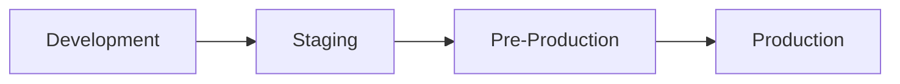
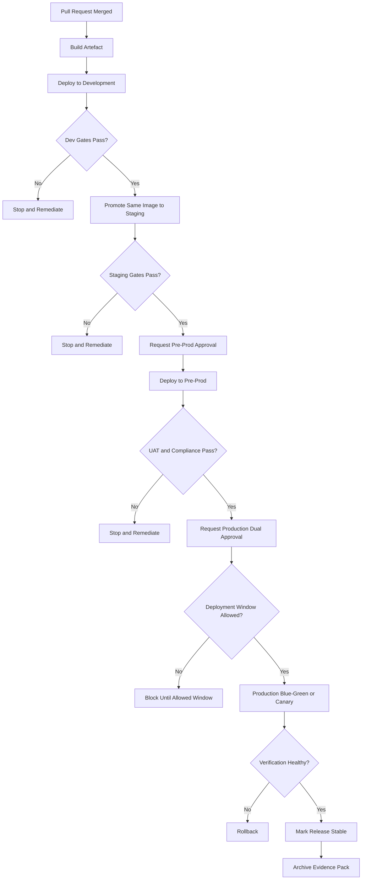

# NovaPay Digital Bank Environment Promotion Workflow

## 1. Purpose

This document defines the environment promotion workflow for NovaPay Digital Bank’s regulated CI/CD pipeline.

NovaPay is moving from manual SSH deployments to a controlled, auditable, automated delivery model. The promotion workflow ensures that the same application artefact is progressively validated across development, staging, pre-production, and production before serving real banking customers.

The workflow enforces quality gates, security gates, compliance checks, segregation of duties, environment-specific configuration, and audit evidence generation.

## 2. Promotion Objectives

The environment promotion model is designed to:

* Promote the same immutable artefact through all environments.
* Prevent environment-specific code branches.
* Enforce security and compliance gates before production.
* Protect production data and customer systems.
* Separate development, testing, compliance, and release responsibilities.
* Provide clear approval requirements per environment.
* Generate audit-ready evidence at every promotion stage.
* Support blue-green, canary, and rollback strategies.
* Reduce commit-to-production time while preserving banking controls.

## 3. Environment Model

NovaPay uses four controlled environments:



| Environment    | Purpose                                           | Data Profile                       | Access Control               | Deployment Trigger                         |
| -------------- | ------------------------------------------------- | ---------------------------------- | ---------------------------- | ------------------------------------------ |
| Development    | Feature validation and fast feedback              | Synthetic/mock data only           | Developers and QA            | Automatic after PR merge                   |
| Staging        | Integration, contract, DAST, performance baseline | Anonymised production-like data    | Developers, QA, SRE          | Automatic after dev gates pass             |
| Pre-Production | UAT, compliance verification, release rehearsal   | Masked production subset           | QA, Compliance, DBA, SRE     | Manual approval after staging              |
| Production     | Live customer-facing banking service              | Real customer and transaction data | SRE and Release Manager only | Dual approval and change window validation |

## 4. Same Artefact, Different Configuration

NovaPay follows the principle:

> Build once, promote the same artefact everywhere.

The same container image digest is promoted across all environments. Code does not change between environments. Only configuration changes.

Example:

```text
novapay-lite:1.4.2
sha256:abc123...
```

Promotion path:

```text
dev → staging → pre-prod → production
```

The image digest remains the same at every stage.

## 5. Configuration Hierarchy

Configuration follows a layered model:

```text
base configuration
    ↓
environment override
    ↓
service override
    ↓
runtime secret injection
```

Example structure:

```text
pipeline/helm/novapay-lite/
├── values.yaml
├── values-dev.yaml
├── values-staging.yaml
├── values-preprod.yaml
└── values-production.yaml
```

| Configuration Layer  | Purpose                                      |
| -------------------- | -------------------------------------------- |
| Base config          | Shared defaults across all environments      |
| Environment override | Environment-specific replicas, URLs, limits  |
| Service override     | Service-specific tuning                      |
| Secret injection     | Runtime secrets from approved secret manager |

Production secrets are never stored in Git, Helm values, Kubernetes manifests, or pipeline logs.

## 6. Secrets Management

NovaPay uses a centralized secret manager such as HashiCorp Vault, AWS Secrets Manager, Azure Key Vault, or GCP Secret Manager.

Controls:

* No plaintext secrets in Git.
* No plaintext secrets in Helm values.
* No secrets printed in logs.
* Secret access controlled by environment-specific RBAC.
* Database passwords rotated every 90 days.
* API keys rotated every 30 days.
* Production secret access limited to runtime workloads and approved operators.
* Secret access is logged and monitored.
* Emergency secret rotation procedure exists.

| Secret Type                      |                Rotation Target |
| -------------------------------- | -----------------------------: |
| Database password                |                        90 days |
| API keys                         |                        30 days |
| Service-to-service credentials   |                        90 days |
| Emergency break-glass credential |                After every use |
| Signing keys                     | Based on key management policy |

## 7. Development Environment

### Purpose

Development is used for fast feedback after merge. It validates that the application builds, starts, and passes basic automated checks.

### Data Profile

* Synthetic data only.
* No production customer data.
* No real payment data.
* No live external payment gateway integration.

### Access

* Developers.
* QA engineers.
* Platform engineers.

### Deployment Trigger

Automatic deployment after merge to main, assuming CI gates pass.

### Required Gates

| Gate                       | Requirement                           |
| -------------------------- | ------------------------------------- |
| Build                      | Must pass                             |
| Unit tests                 | Must pass                             |
| SAST                       | Warning or blocking based on severity |
| Dependency scan            | Warning for non-critical issues       |
| Container build            | Must pass                             |
| Basic smoke tests          | Must pass                             |
| Kubernetes manifest render | Must pass                             |

### Promotion Criteria: Development to Staging

* Build succeeds.
* Unit tests pass.
* Application container image created.
* Image tagged with version and commit SHA.
* Basic smoke tests pass.
* No Critical SAST findings.
* No Critical dependency/container findings.
* Helm chart renders successfully.
* Artefact metadata recorded.

## 8. Staging Environment

### Purpose

Staging validates service integration, API compatibility, DAST, and operational behaviour before compliance/UAT review.

### Data Profile

* Anonymised production-like data.
* No raw production PII.
* No live payment credentials.
* External integrations use sandbox endpoints.

### Access

* Development team.
* QA team.
* SRE team.
* Security team for scanning activities.

### Deployment Trigger

Automatic deployment after development promotion gates pass.

### Required Gates

| Gate                  | Requirement   |
| --------------------- | ------------- |
| Integration tests     | Must pass     |
| Contract tests        | Must pass     |
| OpenAPI compatibility | Must pass     |
| DAST                  | Must complete |
| Dependency scan       | Blocking      |
| Container scan        | Blocking      |
| SBOM                  | Mandatory     |
| Licence scan          | Mandatory     |
| Performance baseline  | Required      |
| Helm/K8s validation   | Required      |

### Promotion Criteria: Staging to Pre-Production

* All integration tests pass.
* Consumer-driven contract tests pass.
* DAST scan completes with 0 Critical/High findings.
* Dependency scan has 0 Critical findings.
* SBOM is generated and archived.
* Licence compliance check passes.
* Container image scan completes.
* Performance test meets baseline.
* No breaking OpenAPI changes.
* Tech Lead approval is recorded.
* QA sign-off is recorded.

## 9. Pre-Production Environment

### Purpose

Pre-production is the final rehearsal environment before production. It validates regulatory controls, UAT, production-like configuration, database migration safety, deployment runbooks, and rollback readiness.

### Data Profile

* Masked production data subset.
* Data masking approved by Compliance and Security.
* No unnecessary raw customer identifiers.
* Payment integrations use controlled test/sandbox mode unless explicitly approved.

### Access

* QA.
* SRE.
* DBA.
* Compliance owner.
* Release Manager.
* Security team.

### Deployment Trigger

Manual approval after staging gates pass.

### Required Gates

| Gate                      | Requirement                             |
| ------------------------- | --------------------------------------- |
| UAT                       | Product Owner sign-off                  |
| Compliance mapping        | RBI/PCI mapping verified                |
| Database migration test   | Required for DB changes                 |
| Rollback test             | Required for high-risk release          |
| Deployment runbook review | Required                                |
| SRE readiness             | Required                                |
| Security approval         | Required for security-sensitive changes |
| DBA approval              | Required for DB migration               |
| CAB/change approval       | Required for production-bound release   |

### Promotion Criteria: Pre-Production to Production

* UAT sign-off from Product Owner.
* Compliance gates passed.
* RBI and PCI-DSS mapping reviewed.
* Database migration validated with production-like data.
* Rollback plan reviewed.
* Deployment runbook reviewed and updated.
* Incident playbook available.
* SRE Lead confirms operational readiness.
* Release Manager approves release.
* Change Advisory Board approval or pre-approved change category exists.
* Deployment is outside blackout window.
* On-call engineer is available and briefed.
* Production approval requires separate Release Manager and SRE Lead approval.

## 10. Production Environment

### Purpose

Production serves real NovaPay customers and handles live banking workloads.

### Data Profile

* Real customer data.
* Real payment and transaction data.
* Full compliance and audit controls.
* Strict access logging.

### Access

* SRE team.
* Release Manager.
* Limited production support roles.
* Break-glass access only with approval and audit logging.

Developers do not directly deploy to production.

### Deployment Trigger

Manual gated deployment after all pre-production criteria pass.

### Production Gates

| Gate                         | Requirement                  |
| ---------------------------- | ---------------------------- |
| Dual approval                | Release Manager and SRE Lead |
| Change ticket                | Mandatory                    |
| Compliance evidence          | Mandatory                    |
| Image signature              | Required                     |
| SBOM                         | Required                     |
| DAST                         | Passed                       |
| Policy gate                  | Passed                       |
| Deployment window check      | Passed                       |
| On-call confirmation         | Required                     |
| Rollback plan                | Required                     |
| Post-deployment verification | Required                     |

## 11. Promotion Workflow



## 12. Approval Matrix

| Change Type                 | Dev             | Staging                | Pre-Prod           | Production                    |
| --------------------------- | --------------- | ---------------------- | ------------------ | ----------------------------- |
| Normal application change   | Automated       | Automated              | Tech Lead + QA     | Release Manager + SRE Lead    |
| Security-sensitive change   | Automated       | Security scan required | Security review    | CISO if high risk             |
| Database expand migration   | Automated test  | DBA review             | DBA approval       | DBA + Release Manager         |
| Database contract migration | Not applicable  | Test only              | DBA + Compliance   | CAB + DBA + SRE Lead          |
| Infrastructure change       | Platform review | Checkov required       | Platform approval  | SRE Lead + Release Manager    |
| Emergency hotfix            | Fast-track      | Mandatory gates        | Expedited approval | Dual approval, no gate bypass |

## 13. Segregation of Duties

NovaPay enforces segregation of duties.

Rules:

* Code author cannot self-approve pull request.
* Developer cannot approve production deployment.
* Release Manager and SRE Lead must be separate people.
* DBA approval is mandatory for database migrations.
* CISO approval is mandatory for Critical security exceptions.
* Compliance owner approval is mandatory for regulatory exceptions.
* Break-glass production access requires post-use review.

| Role             | Allowed Actions                              | Restricted Actions               |
| ---------------- | -------------------------------------------- | -------------------------------- |
| Developer        | Create code, fix defects, view non-prod logs | Direct production deployment     |
| QA               | Test and sign off UAT                        | Change production infrastructure |
| DBA              | Review/approve DB migrations                 | Approve own application release  |
| SRE              | Operate production, execute rollback         | Self-approve business release    |
| Release Manager  | Approve production release                   | Bypass security gates            |
| CISO             | Approve security exception                   | Modify application code          |
| Compliance Owner | Approve regulatory exception                 | Deploy production code           |

## 14. Deployment Window and Blackout Calendar

Production deployments are blocked during high-risk windows unless emergency approval is granted.

Blackout periods:

* Salary days: 1st, 7th, and 15th of each month.
* Month-end processing: 28th to 31st.
* Peak UPI/payment usage windows: 10 AM-12 PM IST and 5 PM-8 PM IST.
* Major festivals: Diwali, Holi, Eid, Christmas.
* RBI settlement windows.
* Regulatory filing deadlines.
* Active SEV-1 or SEV-2 incident.
* Planned marketing campaign traffic windows.

Pipeline decision:

```text
if production_deployment_requested and current_time in blackout_window:
    block deployment
    require emergency change approval
```

Emergency deployment still requires:

* Build gate.
* Security gate.
* Policy gate.
* Change ticket.
* Dual approval.
* Rollback plan.
* Post-deployment verification.

## 15. Data Management by Environment

| Environment    | Data Type                       | Rules                                    |
| -------------- | ------------------------------- | ---------------------------------------- |
| Development    | Synthetic/mock data             | No production data allowed               |
| Staging        | Anonymised production-like data | PII removed or anonymised                |
| Pre-Production | Masked production subset        | Restricted access and masking validation |
| Production     | Real customer data              | Full audit and access control            |

Data controls:

* No production database dumps in developer machines.
* Data masking jobs are approved by Compliance.
* Masked data is validated before use.
* Data retention follows policy.
* Access to pre-prod masked data is logged.
* Synthetic data generators are preferred for development.

## 16. Feature Flag Strategy

NovaPay uses feature flags to decouple deployment from release.

Feature flag controls:

* New features can be deployed disabled.
* Production activation requires approval.
* Rollout can progress by percentage: 1% → 10% → 50% → 100%.
* Flags have owners and expiry dates.
* Stale flags are removed.
* High-risk features require monitoring and rollback plan.
* Feature flag changes are audited like code changes.

Feature flag promotion example:

```text
dev: enabled for testing
staging: enabled for integration validation
pre-prod: enabled for UAT
production: disabled by default, enabled gradually after approval
```

## 17. Configuration Drift Detection

NovaPay uses GitOps drift detection through ArgoCD.

Controls:

* Desired state is stored in Git.
* ArgoCD compares desired state with live cluster state.
* Drift is checked every few minutes.
* Unauthorized production drift triggers alert.
* Critical drift can trigger automated resync or manual approval workflow.
* Drift reports are archived as evidence.

Drift examples:

* Manual kubectl edit in production.
* Replica count changed outside Git.
* Image tag changed outside pipeline.
* Resource limits modified outside approval.
* Policy labels removed.

Required action:

```text
unauthorized_drift_detected:
    alert SRE
    create incident/change record
    compare live vs desired state
    revert or approve through change workflow
```

## 18. Artefact Promotion Metadata

Every promoted artefact includes:

```json
{
  "application": "novapay-lite",
  "version": "1.4.2",
  "commit_sha": "abc123",
  "pipeline_run_id": "run-456",
  "image_tag": "1.4.2-abc123",
  "image_digest": "sha256:...",
  "sbom_uri": "s3://novapay-evidence/run-456/sbom.json",
  "sast_status": "passed",
  "dast_status": "passed",
  "container_scan_status": "passed",
  "policy_status": "passed",
  "promoted_from": "staging",
  "promoted_to": "pre-prod",
  "approved_by": ["qa-lead", "tech-lead"],
  "timestamp": "2026-06-10T10:00:00Z"
}
```

## 19. Evidence Required Per Environment

### Development Evidence

* Build log.
* Unit test report.
* Basic SAST result.
* Container build output.
* Image tag and digest.
* Smoke test result.

### Staging Evidence

* Integration test report.
* Contract test report.
* DAST report.
* Dependency/container scan report.
* SBOM.
* OpenAPI compatibility result.
* Performance baseline result.

### Pre-Production Evidence

* UAT sign-off.
* Compliance mapping.
* DBA approval for migrations.
* Runbook review.
* Rollback rehearsal result.
* Production readiness checklist.
* CAB or change approval.

### Production Evidence

* Dual approval record.
* Deployment strategy selected.
* Helm/ArgoCD deployment log.
* Image digest verification.
* Blue-green or canary traffic log.
* Smoke test result.
* Prometheus metrics snapshot.
* Alert status.
* Rollback record if applicable.
* Final release notes.

## 20. Promotion Gate Summary

| Promotion             | Gate Type                             | Decision                                              |
| --------------------- | ------------------------------------- | ----------------------------------------------------- |
| Dev → Staging         | Automated quality/security            | Promote if build, tests, SAST, scan pass              |
| Staging → Pre-Prod    | Automated + manual technical approval | Promote if integration, DAST, SBOM, performance pass  |
| Pre-Prod → Production | Manual regulated approval             | Promote only after UAT, compliance, CAB/dual approval |
| Production → Stable   | Automated verification                | Mark stable only after smoke/SLO verification         |

## 21. Environment-Specific Controls

| Control                | Dev           | Staging  | Pre-Prod           | Production              |
| ---------------------- | ------------- | -------- | ------------------ | ----------------------- |
| Real customer data     | No            | No       | Masked subset only | Yes                     |
| Auto-deploy            | Yes           | Yes      | No                 | No                      |
| SAST blocking          | Critical only | Yes      | Yes                | Yes                     |
| DAST required          | No            | Yes      | Yes                | Prior result required   |
| SBOM required          | Yes           | Yes      | Yes                | Yes                     |
| Image signing required | Recommended   | Required | Required           | Required                |
| Dual approval          | No            | No       | No                 | Yes                     |
| Rollback automation    | Basic         | Required | Required           | Required                |
| Audit retention        | Standard      | Standard | Extended           | Banking audit retention |

## 22. Rollback by Environment

| Environment    | Rollback Method                                                  |
| -------------- | ---------------------------------------------------------------- |
| Development    | Redeploy previous image                                          |
| Staging        | Helm rollback or ArgoCD sync to previous revision                |
| Pre-Production | Helm/ArgoCD rollback with approval notification                  |
| Production     | Blue-green/canary traffic rollback with incident/evidence record |

Production rollback can be automatic for Category A and Category B triggers as defined in the rollback specification.

## 23. Local NovaPay Lite Evidence Mapping

NovaPay Lite local evidence supports the promotion workflow by demonstrating:

| Evidence File               | Promotion Relevance            |
| --------------------------- | ------------------------------ |
| `docker-build.txt`          | Build/package stage            |
| `docker-image-inspect.json` | Artefact metadata              |
| `trivy-image-report.txt`    | Security scan evidence         |
| `docker-compose-ps.txt`     | Runtime service evidence       |
| `health-endpoint.txt`       | Smoke verification             |
| `version-endpoint.json`     | Release identity               |
| `prometheus-metrics.txt`    | Observability readiness        |
| `openapi-runtime.json`      | API contract visibility        |
| `customer-api-response.txt` | Synthetic API test             |
| `customer-db-row.txt`       | Database persistence evidence  |
| `helm-lint.txt`             | Deployment template validation |
| `helm-rendered.yaml`        | Kubernetes manifest evidence   |

This evidence is local demonstration evidence only. Production promotion requires full CI/CD gates, approval records, and runtime observability.

## 24. Production Readiness Checklist

Before production promotion:

* Same image digest promoted from pre-production.
* Release notes prepared.
* Change ticket approved.
* Dual approval completed.
* SAST passed or exception approved.
* DAST passed or exception approved.
* SBOM generated.
* Container scan completed.
* Image signed.
* Kubernetes policies passed.
* Database migration validated.
* Rollback plan confirmed.
* Runbook reviewed.
* On-call engineer available.
* Deployment outside blackout window.
* Monitoring dashboards ready.
* Incident channel prepared.
* Status communication template ready.

## 25. Failure Handling

| Failure                            | Action                                     |
| ---------------------------------- | ------------------------------------------ |
| Dev gate fails                     | Stop and return to developer               |
| Staging integration fails          | Stop and create defect                     |
| DAST fails                         | Block promotion and create security ticket |
| SBOM missing                       | Block promotion                            |
| Critical CVE found                 | Block promotion                            |
| Pre-prod UAT fails                 | Stop production promotion                  |
| DBA approval missing               | Block migration deployment                 |
| CAB approval missing               | Block production promotion                 |
| Blackout window active             | Block deployment                           |
| Post-deployment verification fails | Rollback                                   |

## 26. Success Metrics

NovaPay measures environment promotion effectiveness using:

| Metric                             | Target                            |
| ---------------------------------- | --------------------------------- |
| Dev deployment success rate        | > 95%                             |
| Staging promotion success rate     | > 90%                             |
| Pre-prod gate pass rate            | > 85%                             |
| Production deployment success rate | > 99%                             |
| Commit-to-production time          | Under 2 hours for standard change |
| Change failure rate                | Under 5%                          |
| Deployment-caused MTTR             | Under 15 minutes                  |
| Evidence completeness              | 100%                              |
| Unauthorized production drift      | 0                                 |

## 27. Conclusion

NovaPay’s environment promotion workflow provides a controlled path from development to production. It balances fast engineering feedback with strict banking compliance and operational safety.

The key design principles are same-artefact promotion, environment-specific configuration, automated security gates, controlled production approval, no environment-specific code branches, and full evidence generation.

This workflow enables NovaPay to release faster while preserving the governance, auditability, and reliability expected from a regulated digital bank.
