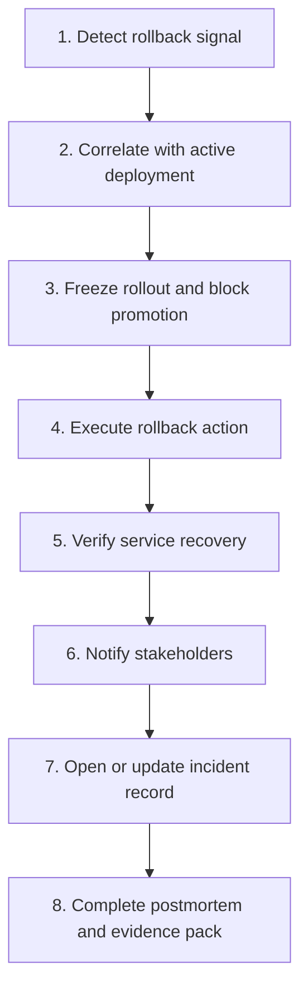
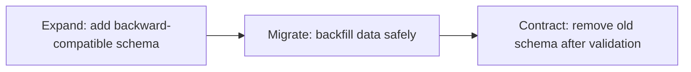

# NovaPay Digital Bank Automated Rollback Specification

## 1. Purpose

This document defines the automated rollback strategy for NovaPay Digital Bank's regulated zero-downtime CI/CD platform.

NovaPay is moving from manual SSH deployments and 4.5-hour MTTR to a controlled deployment model where production releases are continuously verified, automatically stopped when risk signals appear, and rolled back safely before customer impact spreads.

The rollback specification applies to:

* Blue-green deployments.
* Canary deployments.
* Kubernetes workload releases.
* GitOps-based ArgoCD deployments.
* Helm release changes.
* Configuration changes such as WAF rules, feature flags, routing rules, and Kubernetes manifests.
* Database migration phases using the expand-contract pattern.
* Production and pre-production verification workflows.

The goal is to make rollback fast, safe, auditable, and compliant with banking change-management expectations.

## 2. Rollback Objectives

| Objective | Target |
|---|---:|
| Immediate rollback initiation for critical release failure | Under 60 seconds |
| Escalated rollback decision for severe degradation | Under 15 minutes |
| Deployment-caused MTTR | Under 15 minutes |
| Customer impact containment during canary | Limited to initial traffic percentage |
| Production evidence capture | 100% for every rollback |
| Human approval required for destructive rollback | Always |
| Compliance traceability | Every rollback linked to deployment ID, commit SHA, image digest, change ticket, and incident ID |

Rollback is not a replacement for quality gates. It is the final safety mechanism after source control controls, build gates, SAST, dependency scanning, container scanning, integration testing, contract testing, DAST, policy checks, compliance checks, deployment verification, and observability have already reduced release risk.

## 3. Rollback Design Principles

NovaPay follows these rollback principles:

1. **Fail closed for production safety.** If a release violates critical health, security, or compliance thresholds, production rollout stops.
2. **Automate obvious failures.** Clear technical failures such as high HTTP 5xx rate, failed health checks, CrashLoopBackOff, and database pool exhaustion trigger automated rollback.
3. **Escalate ambiguous failures.** Slow degradation, customer reports, and downstream dependency correlation require SRE judgment.
4. **Preserve evidence before cleanup.** Logs, metrics, traces, events, and deployment metadata must be captured before failed release resources are deleted.
5. **Prefer traffic rollback over binary redeployment.** For blue-green and canary releases, first move traffic back to the known-good version.
6. **Never auto-rollback destructive database changes.** Expand and migrate phases may be reversed or retried; contract phase is forward-only and requires DBA approval.
7. **Rollback path must be independent.** The emergency rollback mechanism must not depend only on the same pipeline path that caused the failure.
8. **Segregation of duties must remain intact.** Emergency rollback can be executed by SRE automation, but production override actions must be logged and reviewed.

## 4. Rollback Scope by Change Type

| Change Type | Rollback Method | Automation Level |
|---|---|---|
| Application image release | Route traffic to previous stable image or previous color | Automated for Category A |
| Canary release | Set canary weight to 0%, keep stable at 100% | Automated for Category A |
| Blue-green release | Switch traffic back to previous active color | Automated for Category A |
| Helm chart change | Roll back Helm revision or GitOps commit | Automated or SRE approved |
| Kubernetes manifest change | Revert Git commit or ArgoCD sync to previous revision | Automated or SRE approved |
| WAF / routing / config rule | Disable rule or restore previous config version | Automated for critical impact |
| Feature flag change | Disable flag or reduce rollout percentage | Automated if linked to incident |
| Expand database migration | Drop newly added unused objects only if safe | DBA-approved |
| Data backfill migration | Stop job, retry idempotently, or restore affected batch | DBA-approved |
| Contract database migration | Forward fix or restore from backup only after CAB/DBA approval | Manual only |

## 5. Rollback Categories

Rollback triggers are grouped into three categories.

## 5.1 Category A: Immediate Automated Rollback

Category A failures indicate a clear and immediate production release failure. These triggers must initiate rollback within 60 seconds without waiting for human approval.

| Trigger | Detection Method | Threshold | Action |
|---|---|---:|---|
| HTTP 5xx spike | Prometheus HTTP metrics | 5xx rate > 5% for 60 seconds | Immediate rollback |
| Health check failure | Kubernetes readiness/liveness and synthetic health checks | 3 consecutive failures | Immediate rollback |
| CrashLoopBackOff | Kubernetes pod status | Any production pod in new release enters CrashLoopBackOff | Immediate rollback |
| OOMKilled | Kubernetes container status | Any new release pod OOMKilled repeatedly within 60 seconds | Immediate rollback |
| Database pool exhaustion | HikariCP / pgBouncer metrics | Pending DB connections > 0 for 60 seconds or active pool > 90% | Immediate rollback |
| Synthetic critical journey failure | Synthetic monitoring | 2 consecutive failures for payment or login journey | Immediate rollback |
| Version mismatch after deployment | Post-deploy verification | Any production pod running unexpected image digest | Immediate rollback |
| Canary critical error rate | Canary/stable comparison | Canary error rate > 2x stable and absolute canary error rate > 1% | Immediate rollback |
| Payment API hard failure | Business metrics | Payment success rate drops below 95% during release window | Immediate rollback |
| Kubernetes readiness collapse | Kubernetes metrics | Ready replicas below minimum availability for new release | Immediate rollback |

Category A output:

* Freeze deployment.
* Route traffic to last known-good version.
* Capture evidence pack.
* Open incident if customer-facing impact exists.
* Notify SRE, Release Manager, Tech Lead, and CISO for security-related failures.

## 5.2 Category B: Escalated Rollback

Category B failures show serious degradation but may require correlation before rollback. The system alerts SRE immediately and auto-rolls back if the issue remains unresolved or unacknowledged within the escalation window.

| Trigger | Detection Method | Threshold | Escalation Window | Action |
|---|---|---:|---:|---|
| p99 latency degradation | Prometheus histogram | p99 > 2x 7-day baseline for 5 minutes | 15 minutes | Pause rollout, escalate, rollback if unresolved |
| Error budget burn | SLO monitoring | Burn rate > 10x normal for 10 minutes | 15 minutes | Pause rollout and evaluate rollback |
| Payment success degradation | Business metrics | Drop > 2% below baseline for 5 minutes | 15 minutes | Pause rollout and escalate |
| Resource saturation | Kubernetes/node metrics | CPU > 90% or memory > 85% for 5 minutes | 15 minutes | Pause rollout and evaluate |
| Queue backlog | RabbitMQ metrics | Queue depth > 1000 or > 2x baseline for 10 minutes | 15 minutes | Pause rollout and evaluate |
| DB latency degradation | PostgreSQL metrics | Query p99 > 2x baseline for 5 minutes | 15 minutes | Pause rollout and involve DBA |
| Canary composite score failure | Rollout analysis job | Weighted score below promotion threshold | Immediate pause, rollback after review | Stop promotion |
| Elevated timeout rate | Application / gateway metrics | Timeout rate > 2x baseline for 5 minutes | 15 minutes | Pause rollout and evaluate |
| Downstream payment gateway timeouts | Application business metrics | Timeout rate > 25% during release | 15 minutes | Pause rollout and isolate release |
| Repeated alert flapping | Alertmanager | Same release alert flaps 3+ times in 30 minutes | 15 minutes | Hold release for review |

Category B output:

* Pause rollout.
* Notify SRE on-call and Release Manager.
* Create incident bridge if customer-facing.
* Compare canary vs stable metrics.
* Roll back automatically if not acknowledged within escalation window or if degradation worsens.

## 5.3 Category C: Manual Decision Rollback

Category C failures require human judgment because the signal is ambiguous, regulatory in nature, or not safely reversible by automation.

| Trigger | Detection Method | Decision Owner | Action |
|---|---|---|---|
| Gradual degradation below automated thresholds | Trend dashboard | SRE Lead | Manual rollback or continue monitoring |
| Customer support reports without metric confirmation | Support escalation | Incident Commander | Investigate and decide |
| Compliance anomaly after deployment | Compliance dashboard | Compliance Lead + Release Manager | Freeze release and assess |
| Security exception expiry discovered post-release | Compliance scan | CISO delegate | Risk review |
| Data quality concern | Application logs / reconciliation | DBA + Product Owner | Manual rollback or forward fix |
| Downstream dependency correlation unclear | Tracing and external status | SRE Lead | Decide whether rollback helps |
| False positive suspected | Alert review | SRE Lead | Suppress, tune alert, or rollback |
| Contract phase database issue | DB validation | DBA + CAB | Manual forward fix or restore plan |
| Regulatory reporting impact | Incident review | Compliance Lead | Notify required stakeholders |
| Business stakeholder concern | Product / operations | Release Manager | Manual release hold |

Category C output:

* Open decision record.
* Assign owner.
* Capture evidence.
* Approve rollback, continue monitoring, or apply forward fix.
* Document rationale in incident or change record.

## 6. Rollback Decision Matrix

| Condition | Category | Automation | Human Approval Required Before Action? |
|---|---|---|---|
| Clear technical outage caused by new release | A | Full rollback automation | No |
| Canary version fails critical health | A | Full rollback automation | No |
| Production pod version mismatch | A | Full rollback automation | No |
| Severe but not total performance degradation | B | Pause automation, timed escalation | Only if acknowledged quickly |
| Business metric degradation with unclear source | B or C | Pause and escalate | Yes if correlation unclear |
| Compliance evidence missing after release | C | Freeze release | Yes |
| Destructive database change issue | C | No automatic rollback | Yes |
| Security incident unrelated to release | C | Incident process | Yes |

## 7. Rollback Signal Sources

Rollback decisions consume signals from the following systems:

| Source | Signal Examples |
|---|---|
| Prometheus | Error rate, latency, saturation, DB pool usage, queue depth |
| Alertmanager | Alert severity, route, acknowledgement state |
| Kubernetes API | Pod readiness, CrashLoopBackOff, OOMKilled, replica availability |
| ArgoCD | Sync status, health status, revision, drift detection |
| Istio / service mesh | Traffic weight, request success rate, mTLS status, routing errors |
| Synthetic monitoring | Health, login, account lookup, payment simulation |
| Application metrics | Payment success, timeout rate, idempotency failures |
| Logs / Loki | Error bursts, exception signatures, failed migrations |
| Traces / Jaeger | Downstream latency, version-specific request failures |
| CI/CD metadata | Commit SHA, image digest, deployment ID, run ID |
| Compliance systems | Gate results, evidence pack status, exception status |

## 8. Eight-Step Rollback Execution Workflow

Every rollback follows the same controlled workflow.



### Step 1: Detect

The rollback decision engine receives a Prometheus alert, Kubernetes event, ArgoCD event, synthetic check failure, or business metric breach.

Required data:

* Deployment ID.
* Environment.
* Application name.
* Release version.
* Image digest.
* Active traffic percentage.
* Alert name.
* Alert category.
* Timestamp.
* Metric value and threshold.

### Step 2: Correlate

The system confirms whether the alert is connected to the active deployment.

Correlation checks:

* Did the alert begin within the deployment verification or bake window?
* Is the alert limited to canary or green traffic?
* Did the same metric remain healthy on stable or blue version?
* Did the same commit change the affected service?
* Did logs or traces show new version-specific errors?
* Did dependencies outside NovaPay fail independently?

If correlation is strong and the trigger is Category A, rollback proceeds automatically.

### Step 3: Freeze

The pipeline freezes all release activity for the affected service.

Freeze actions:

* Stop canary promotion.
* Disable automatic ArgoCD sync for the affected application if required.
* Block further production promotions.
* Prevent additional traffic shift.
* Create incident or rollback record.
* Preserve failed release pods until evidence is captured unless they are harming production.

### Step 4: Execute Rollback

The rollback action depends on deployment strategy.

* Canary: set canary traffic to 0% and stable traffic to 100%.
* Blue-green: switch traffic back to previous color.
* Rolling deployment: restore previous ReplicaSet or Helm revision.
* GitOps: revert application manifest to last known-good Git revision.
* Feature flag: disable or reduce flag exposure.
* WAF/config: restore previous configuration version.
* Database: stop migration/backfill and follow database rollback plan.

### Step 5: Verify Recovery

Rollback is not complete until verification passes.

Minimum verification:

* Health endpoint passes.
* Version endpoint shows stable version.
* HTTP 5xx rate returns below threshold.
* p99 latency returns within acceptable range.
* Synthetic payment/account journey passes.
* DB connection pool normalizes.
* No CrashLoopBackOff/OOMKilled pods remain.
* ArgoCD shows healthy state.
* Error budget burn returns to normal.
* Customer impact estimate is updated.

### Step 6: Notify

Notification is sent to required stakeholders.

Category A notification recipients:

* SRE on-call.
* Release Manager.
* Tech Lead.
* VP Engineering for customer-facing impact.
* CISO if security related.
* Compliance Lead if regulatory or audit evidence related.
* Incident channel.

Category B notification recipients:

* SRE on-call.
* Release Manager.
* Owning engineering team.
* DBA or security owner if applicable.

Category C notification recipients:

* Decision owner.
* Release Manager.
* Risk/compliance owner if applicable.

### Step 7: Incident Record

Create or update the incident record when rollback is customer-impacting, regulatory-impacting, or linked to production instability.

Incident record must include:

* Incident ID.
* Deployment ID.
* Change ticket.
* Service.
* Environment.
* Trigger.
* Timeline.
* Action taken.
* Customer impact.
* Regulatory impact.
* Current status.
* Next owner.

### Step 8: Postmortem and Evidence Pack

After service restoration, the team completes postmortem and evidence packaging.

Evidence pack includes:

* Deployment metadata.
* Alert payloads.
* Metrics snapshots before, during, and after rollback.
* Logs and traces.
* ArgoCD revision history.
* Kubernetes event export.
* Traffic routing change log.
* Synthetic test results.
* Approval/override records.
* Incident timeline.
* Root cause and corrective actions.

## 9. Canary Rollback Specification

Canary rollback is the default rollback path for progressive releases.

### Canary Promotion Phases

| Phase | Traffic | Duration | Promotion Requirement |
|---|---:|---:|---|
| Canary 1 | 1-2% | 15 minutes | Error rate < 0.1%, p99 < 200ms or within baseline |
| Early adopter | 5-10% | 30 minutes | Error rate < 0.05%, no critical alerts |
| Expansion | 25-50% | 60 minutes | All SLOs met and no baseline degradation |
| Full rollout | 100% | 24-hour bake | Complete SLO compliance |

### Canary Auto-Rollback Conditions

| Metric | Threshold |
|---|---:|
| Canary HTTP 5xx rate | > 1% and > 2x stable |
| Canary p99 latency | > 2x stable for 5 minutes |
| Canary CPU | > 90% for 5 minutes |
| Canary memory | > 85% for 5 minutes |
| Synthetic journey | 2 consecutive failures |
| Payment success rate | > 2% below stable |
| Critical log exception | New release-only critical exception burst |
| Contract compatibility | Any consumer contract break |

### Canary Rollback Steps

1. Pause rollout.
2. Set canary traffic weight to 0%.
3. Set stable traffic weight to 100%.
4. Keep canary pods available for evidence capture.
5. Verify stable metrics.
6. Notify SRE and release stakeholders.
7. Mark deployment as failed.
8. Open defect and link to deployment evidence.

### Example Istio Canary Rollback

```yaml
apiVersion: networking.istio.io/v1beta1
kind: VirtualService
metadata:
  name: novapay-api
  namespace: novapay-prod
spec:
  hosts:
    - api.novapay.example
  http:
    - route:
        - destination:
            host: novapay-api
            subset: stable
          weight: 100
        - destination:
            host: novapay-api
            subset: canary
          weight: 0
```

## 10. Blue-Green Rollback Specification

Blue-green rollback switches production traffic back to the previously active environment.

### Blue-Green Preconditions

Before traffic switch:

* Green version deployed successfully.
* Green pods ready.
* Green synthetic checks passed.
* Green version endpoint verified.
* Database schema backward compatible with blue and green.
* Redis session store shared and healthy.
* Long-running payment jobs drained or protected.
* Traffic switch approved by release policy.

### Blue-Green Rollback Triggers

| Trigger | Action |
|---|---|
| Green health failure after switch | Route back to blue |
| Green 5xx rate > 5% for 60 seconds | Route back to blue |
| Green latency > 2x blue baseline | Route back to blue or pause |
| Green DB pool exhaustion | Route back to blue |
| Synthetic payment failure | Route back to blue |
| Version mismatch | Route back to blue |
| Compliance gate failure discovered after release | Freeze and route back if customer risk exists |

### Blue-Green Rollback Steps

1. Freeze release.
2. Confirm previous color is healthy.
3. Reconfigure service mesh or load balancer to previous color.
4. Drain failed color connections.
5. Run smoke tests against previous color.
6. Confirm customer traffic recovery.
7. Preserve failed color logs and metrics.
8. Disable or scale down failed color after evidence is captured.
9. Create incident/postmortem if customer impact occurred.

### Example Istio Blue-Green Rollback

```yaml
apiVersion: networking.istio.io/v1beta1
kind: VirtualService
metadata:
  name: novapay-api
  namespace: novapay-prod
spec:
  hosts:
    - api.novapay.example
  http:
    - route:
        - destination:
            host: novapay-api-blue
          weight: 100
        - destination:
            host: novapay-api-green
          weight: 0
```

## 11. Rolling Deployment and Helm Rollback

Rolling deployment is not preferred for high-risk banking production releases, but it may be used for lower-risk internal services.

### Helm Rollback Command

```bash
helm history novapay-api -n novapay-prod
helm rollback novapay-api <previous-revision> -n novapay-prod --wait --timeout 5m
```

### Kubernetes Rollback Command

```bash
kubectl rollout history deployment/novapay-api -n novapay-prod
kubectl rollout undo deployment/novapay-api -n novapay-prod
kubectl rollout status deployment/novapay-api -n novapay-prod --timeout=5m
```

### GitOps Rollback

For ArgoCD-managed production releases, the preferred recovery path is reverting the Git commit that changed the desired state.

```bash
git revert <bad-commit-sha>
git push origin main
argocd app sync novapay-api-prod
argocd app wait novapay-api-prod --health --timeout 300
```

Emergency SRE rollback may temporarily disable auto-sync if the GitOps loop would reapply the failed change.

## 12. Database Migration Rollback

Database migrations are handled differently from application rollback because financial data integrity is more important than speed.

NovaPay uses the expand-contract pattern.



### 12.1 Expand Phase

Examples:

* Add nullable column.
* Add new table.
* Add index concurrently.
* Add backward-compatible constraint.

Rollback approach:

* If the new object is unused, drop it after DBA approval.
* If application V(N) has started using it, do not drop automatically.
* If index creation causes impact, cancel operation and retry during safer window.

Automation level: DBA-approved, not fully automatic.

### 12.2 Migrate Phase

Examples:

* Backfill new column.
* Copy data to new table.
* Recompute derived values.
* Migrate batches of payment records.

Rollback approach:

* Stop the backfill job.
* Retry idempotently from last checkpoint.
* Revert affected batch only when a verified reverse transformation exists.
* Reduce batch size or throttle rate if query latency increases by more than 20%.

Automation level: stop/throttle can be automatic; data reversal requires DBA approval.

### 12.3 Contract Phase

Examples:

* Drop old column.
* Drop old table.
* Remove compatibility code.
* Enforce new non-null constraint.

Rollback approach:

* No automated rollback.
* Use forward fix, restore from backup, or emergency recovery plan.
* Requires DBA, Release Manager, and CAB approval.
* Must have production-scale validation before execution.

Automation level: manual only.

### Database Abort Criteria

| Signal | Threshold | Action |
|---|---:|---|
| Query latency impact | > 20% over baseline | Abort or throttle migration |
| Lock wait time | > approved threshold | Abort migration |
| Replication lag | > approved threshold | Pause migration |
| DB CPU | > 85% for 5 minutes | Throttle or stop |
| Connection pool saturation | Pending connections > 0 for 60 seconds | Stop migration |
| Data validation error | Any mismatch in financial records | Stop and escalate |
| Failed checksum/reconciliation | Any critical mismatch | Stop and escalate |

## 13. Prometheus Rollback Rules

### Category A: HTTP 5xx Rate

```yaml
groups:
  - name: novapay-category-a-rollback
    rules:
      - alert: NovaPayHttp5xxImmediateRollback
        expr: |
          (
            sum(rate(http_server_requests_seconds_count{status=~"5..",environment="production"}[1m]))
            /
            sum(rate(http_server_requests_seconds_count{environment="production"}[1m]))
          ) > 0.05
        for: 1m
        labels:
          severity: critical
          rollback_category: A
          action: auto_rollback
        annotations:
          summary: "HTTP 5xx rate exceeded 5% for 60 seconds"
          runbook: "runbooks/incident-playbook.md#category-a-rollback"
```

### Category A: Database Pool Exhaustion

```yaml
groups:
  - name: novapay-database-rollback
    rules:
      - alert: NovaPayDBPoolExhaustionImmediateRollback
        expr: |
          hikaricp_connections_pending{environment="production"} > 0
        for: 1m
        labels:
          severity: critical
          rollback_category: A
          action: auto_rollback
        annotations:
          summary: "Database connection pool exhaustion detected"
          runbook: "runbooks/incident-playbook.md#database-pool-exhaustion"
```

### Category A: CrashLoopBackOff

```yaml
groups:
  - name: novapay-kubernetes-rollback
    rules:
      - alert: NovaPayNewReleaseCrashLoopBackOff
        expr: |
          kube_pod_container_status_waiting_reason{
            namespace="novapay-prod",
            reason="CrashLoopBackOff",
            release_track!="stable"
          } > 0
        for: 1m
        labels:
          severity: critical
          rollback_category: A
          action: auto_rollback
        annotations:
          summary: "New release pod entered CrashLoopBackOff"
```

### Category B: p99 Latency Degradation

```yaml
groups:
  - name: novapay-category-b-rollback
    rules:
      - alert: NovaPayP99LatencyEscalatedRollback
        expr: |
          histogram_quantile(
            0.99,
            sum(rate(http_server_requests_seconds_bucket{environment="production"}[5m])) by (le, release_track)
          ) > 2 * novapay_latency_p99_baseline
        for: 5m
        labels:
          severity: high
          rollback_category: B
          action: pause_and_escalate
        annotations:
          summary: "p99 latency is greater than 2x baseline for 5 minutes"
          runbook: "runbooks/incident-playbook.md#latency-degradation"
```

### Category B: Payment Success Rate Drop

```yaml
groups:
  - name: novapay-business-rollback
    rules:
      - alert: NovaPayPaymentSuccessRateDropEscalatedRollback
        expr: |
          novapay_payment_success_rate{environment="production"}
          < (novapay_payment_success_rate_baseline - 0.02)
        for: 5m
        labels:
          severity: critical
          rollback_category: B
          action: pause_and_escalate
        annotations:
          summary: "Payment success rate dropped more than 2% below baseline"
```

### Category B: Error Budget Burn

```yaml
groups:
  - name: novapay-slo-rollback
    rules:
      - alert: NovaPayErrorBudgetBurnEscalatedRollback
        expr: |
          novapay_error_budget_burn_rate{environment="production"} > 10
        for: 10m
        labels:
          severity: high
          rollback_category: B
          action: pause_and_escalate
        annotations:
          summary: "Error budget burn rate exceeded 10x normal"
```

## 14. Rollback Decision Engine Pseudocode

```python
def evaluate_rollback(alert, deployment):
    if not deployment.active:
        return "NO_ACTIVE_DEPLOYMENT"

    correlation = correlate_alert_to_deployment(alert, deployment)

    if alert.category == "A" and correlation == "STRONG":
        freeze_deployment(deployment)
        capture_evidence(alert, deployment)
        execute_rollback(deployment)
        verify_recovery(deployment)
        notify_stakeholders(alert, deployment)
        return "AUTO_ROLLBACK_EXECUTED"

    if alert.category == "B":
        pause_rollout(deployment)
        notify_sre(alert, deployment)
        wait_for_acknowledgement(minutes=15)

        if not acknowledged(alert) or degradation_worsened(alert):
            capture_evidence(alert, deployment)
            execute_rollback(deployment)
            verify_recovery(deployment)
            return "ESCALATED_ROLLBACK_EXECUTED"

        return "ROLLOUT_PAUSED_FOR_INVESTIGATION"

    if alert.category == "C":
        create_decision_record(alert, deployment)
        notify_decision_owner(alert, deployment)
        return "MANUAL_DECISION_REQUIRED"
```

## 15. Post-Rollback Verification Checklist

Rollback is successful only after all mandatory checks pass.

| Verification Check | Expected Result |
|---|---|
| Stable version endpoint | Shows previous approved version |
| Image digest verification | Matches last known-good image digest |
| Health endpoint | HTTP 200 |
| Readiness probes | All stable pods ready |
| HTTP 5xx rate | Below 1% and trending normal |
| p99 latency | Within normal baseline |
| Synthetic payment journey | Passes |
| Synthetic account lookup | Passes |
| DB pool pending connections | 0 |
| CrashLoopBackOff | 0 production pods |
| ArgoCD application health | Healthy or intentionally paused |
| Error budget burn | Normalized |
| Alertmanager status | Critical alert resolved or acknowledged |
| Customer impact estimate | Documented |
| Evidence pack | Complete |

## 16. Rollback Communications

### 16.1 Internal Category A Message

```text
[SEV-1 / AUTO-ROLLBACK INITIATED]

Service: novapay-api
Environment: production
Deployment ID: <deployment_id>
Version: <version>
Trigger: <alert_name>
Threshold Breach: <metric_value> vs <threshold>
Action: Traffic is being rolled back to last known-good version.
Current Status: Rollback in progress.
Incident Channel: <link>
Next Update: 5 minutes
Owner: SRE On-Call
```

### 16.2 Rollback Completed Message

```text
[ROLLBACK COMPLETED]

Service: novapay-api
Environment: production
Deployment ID: <deployment_id>
Rolled Back From: <bad_version>
Rolled Back To: <stable_version>
Recovery Verification: Passed
Customer Impact: <summary>
Incident ID: <incident_id>
Evidence Pack: <link>
Next Step: Root cause analysis and postmortem
```

### 16.3 External Status Page Template

```text
We detected elevated errors affecting a subset of NovaPay services. Our automated safety controls reverted the recent deployment and service health has recovered. We are monitoring the platform and will provide another update after verification is complete.
```

### 16.4 Regulatory / Compliance Note

```text
A production rollback was executed for deployment <deployment_id> due to <trigger>. Evidence has been captured, including approval trail, deployment metadata, monitoring data, recovery timeline, and customer impact assessment. Regulatory notification requirement is being assessed by Compliance based on incident duration, customer impact, and service criticality.
```

## 17. Roles and Responsibilities

| Role | Responsibility |
|---|---|
| SRE On-Call | Own rollback execution, verification, and initial incident response |
| Release Manager | Own release freeze, change record update, and stakeholder coordination |
| Tech Lead | Triage code-level root cause and prepare fix |
| DBA | Approve and execute database rollback or migration stop/throttle |
| CISO Delegate | Review security-related rollback triggers |
| Compliance Lead | Assess regulatory impact and evidence completeness |
| Incident Commander | Coordinate SEV-1/SEV-2 response |
| Product Owner | Help assess customer/business impact |
| CAB / TRC | Review high-risk rollback patterns and approve exceptional actions |

## 18. Segregation of Duties

Production rollback must maintain segregation of duties.

| Control | Implementation |
|---|---|
| Developers cannot directly deploy or roll back production | Production credentials restricted to SRE automation and approved SRE roles |
| Release approval separate from implementation | Release Manager and SRE Lead approval for production promotion |
| Emergency rollback allowed but logged | Automation may roll back Category A failures without pre-approval |
| Manual production override requires dual approval | Release Manager + SRE Lead or delegated emergency approvers |
| Database destructive action requires DBA approval | No automated contract-phase rollback |
| Evidence is immutable | Rollback logs and evidence stored in write-once or restricted object storage |

## 19. Audit Evidence Schema

Every rollback emits a structured audit event.

```json
{
  "event_type": "rollback_executed",
  "rollback_id": "rb-2026-0001",
  "deployment_id": "deploy-2026-0007",
  "change_ticket": "CHG-2026-0042",
  "incident_id": "INC-2026-0013",
  "application": "novapay-api",
  "environment": "production",
  "rollback_category": "A",
  "trigger": "NovaPayHttp5xxImmediateRollback",
  "threshold": "HTTP 5xx > 5% for 60s",
  "observed_value": "12%",
  "from_version": "1.6.0",
  "to_version": "1.5.3",
  "from_image_digest": "sha256:bad...",
  "to_image_digest": "sha256:good...",
  "commit_sha": "abc123",
  "pipeline_run_id": "run-789",
  "started_at": "2026-06-10T11:00:00Z",
  "completed_at": "2026-06-10T11:03:30Z",
  "executed_by": "sre-automation",
  "approved_by": null,
  "verification_status": "passed",
  "customer_impact": "limited canary traffic impact",
  "evidence_location": "s3://novapay-audit-evidence/rollback/rb-2026-0001/"
}
```

## 20. Compliance Mapping

| Compliance Requirement | Rollback Control |
|---|---|
| Change management with testing and rollback procedures | Rollback categories, execution workflow, verification checklist |
| Segregation of duties | RBAC, dual approval for manual overrides, restricted production credentials |
| Vulnerability and operational risk response | Release freeze, rollback, incident record, postmortem |
| Comprehensive audit trails | Structured rollback event, evidence pack, immutable logs |
| Incident management and continuity | SEV routing, rollback targets, MTTR objective |
| Third-party and configuration risk | WAF/config rollback, dependency correlation, evidence records |
| PCI-DSS secure change management | Change ticket linkage, approval evidence, post-deployment verification |
| PCI-DSS audit log recording | Rollback event records, alert logs, deployment logs |

## 21. Friday 5 PM Incident Simulation Mapping

Scenario:

* HTTP 500 error rate at 12%.
* PostgreSQL connection pool exhaustion.
* Downstream payment gateway timeout rate at 35%.
* Canary has been running for 8 minutes.

Classification:

| Alert | Category | Reason |
|---|---|---|
| HTTP 500 error rate at 12% | A | Exceeds 5% for immediate rollback |
| PostgreSQL pool exhaustion | A | Direct production stability risk |
| Payment gateway timeout at 35% | B or A depending customer impact | Severe payment degradation during canary |

Expected response:

1. T+0: Alerts fire.
2. T+30s: Rollback decision engine correlates all alerts to active canary deployment.
3. T+60s: Canary rollout frozen.
4. T+90s: Canary traffic set to 0%, stable traffic restored to 100%.
5. T+2m: Incident channel opened, SRE and Release Manager notified.
6. T+3m: Synthetic payment and health checks run against stable.
7. T+5m: DB pool and 5xx metrics verified as recovering.
8. T+10m: Customer impact assessment created.
9. T+15m: Post-rollback evidence pack generated.
10. T+30m: Root cause analysis begins.

Preventive control assessment:

* The hotfix should not have bypassed staging.
* Required missing or bypassed gates: branch protection, mandatory staging promotion, DAST/integration verification, database connection regression test, and dual approval.
* Improvement: enforce emergency hotfix path that is expedited but never bypasses security, compliance, integration, and rollback gates.

## 22. Rollback Testing

Rollback procedures must be tested before production use.

| Test | Frequency | Owner |
|---|---|---|
| Canary auto-rollback drill | Monthly | SRE |
| Blue-green traffic rollback drill | Quarterly | SRE + Release Manager |
| Helm rollback test in staging | Monthly | Platform team |
| ArgoCD Git revert simulation | Monthly | Platform team |
| DB migration abort drill | Quarterly | DBA |
| Synthetic failure injection | Monthly | SRE |
| Incident communication drill | Quarterly | Incident Commander |
| Evidence pack validation | Every production release | Release Manager |

## 23. Rollback Success Metrics

| Metric | Target |
|---|---:|
| Category A rollback initiation time | < 60 seconds |
| Category A rollback completion time | < 5 minutes |
| Category B decision time | < 15 minutes |
| Deployment-caused MTTR | < 15 minutes |
| Rollback verification completion | < 10 minutes |
| False positive auto-rollback rate | < 2% |
| Evidence pack completeness | 100% |
| Failed rollback rate | 0 |
| Customer-reported-first rollback incidents | < 5% |
| Postmortem completion | Within 2 business days |

## 24. Risks and Mitigations

| Risk | Mitigation |
|---|---|
| Rollback automation triggers false positives | Use correlation, canary/stable comparison, and alert tuning |
| Rollback mechanism affected by failed deployment | Maintain independent emergency rollback path |
| Stable version no longer compatible with database | Enforce expand-contract compatibility matrix |
| Evidence lost during cleanup | Capture evidence before scaling down failed release |
| Manual override abuse | Require dual approval and immutable audit logs |
| Rollback hides root cause | Mandatory postmortem and defect linkage |
| Downstream dependency failure misclassified as release failure | Use traces and canary/stable comparison |
| Contract migration cannot be rolled back | Separate contract phase, DBA approval, backup and forward-fix plan |

## 25. Conclusion

NovaPay's rollback specification provides a controlled safety system for regulated banking deployments.

Category A triggers protect customers through immediate automated rollback. Category B triggers pause and escalate severe degradation within a 15-minute window. Category C triggers require human decision-making for ambiguous, regulatory, or destructive-change scenarios.

By integrating Prometheus, Alertmanager, Kubernetes events, ArgoCD, Istio traffic control, synthetic monitoring, business metrics, audit evidence, and incident management, NovaPay can reduce deployment risk, preserve compliance evidence, and meet the target of restoring deployment-caused incidents in under 15 minutes.
