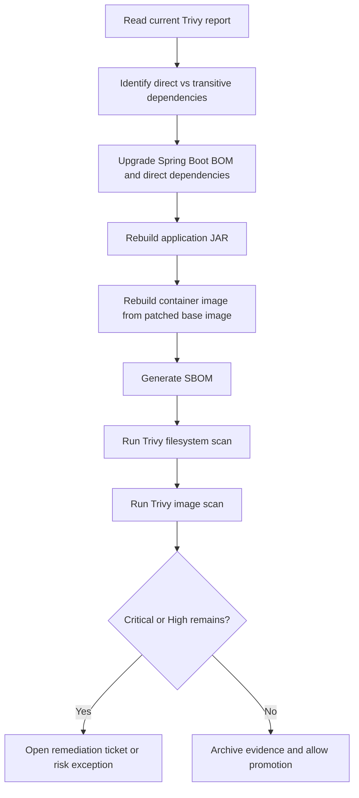

# Trivy Remediation Plan

## Gate Rule

NovaPay production releases must fail when Trivy detects:

* Any Critical vulnerability.
* Any High vulnerability with CVSS greater than 8.0.
* Missing SBOM.
* Unapproved licence.
* Unsigned image.

## Current Gate Result

The current local evidence image fails the production dependency/container scanning gate because the Trivy report shows Critical and High Java dependency findings.

## Recommended Remediation Flow



## Commands

```bash
./gradlew clean test bootJar

docker build -t novapay-lite:0.0.1 .

trivy fs --scanners vuln,secret,misconfig --severity CRITICAL,HIGH --exit-code 1 .

trivy image --format table --output evidence/test-results/trivy-image-after-remediation.txt novapay-lite:0.0.1

trivy image --severity CRITICAL,HIGH --exit-code 1 novapay-lite:0.0.1
```

## SBOM Evidence

```bash
trivy image --format cyclonedx --output evidence/test-results/novapay-lite-sbom.cdx.json novapay-lite:0.0.1
```

## Closure Criteria

| Criterion | Required Result |
|---|---|
| Critical vulnerabilities | 0 |
| High vulnerabilities | 0 or approved time-bound exception |
| SBOM | Generated and archived |
| Base image | Patched rebuild completed |
| CI evidence | Stored in evidence folder |
| Security owner | Sign-off recorded |
