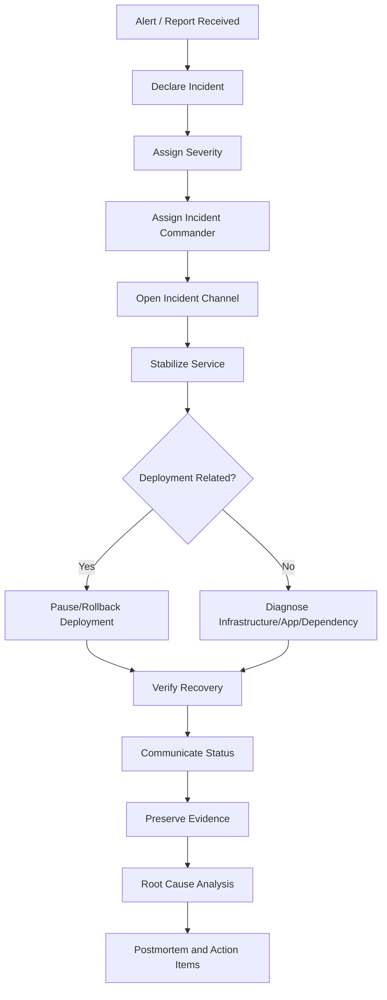

# NovaPay Digital Bank Incident Response Playbook

## 1. Purpose

This playbook defines the incident response process for NovaPay Digital Bank’s production CI/CD and runtime platform.

NovaPay is moving from customer-reported incidents and manual recovery to system-detected incidents, automated rollback, structured escalation, and audit-ready postmortems. This playbook is designed for SREs, Release Managers, developers, security teams, compliance owners, and executives responding to incidents affecting banking services.

The playbook supports production incidents caused by failed deployments, infrastructure degradation, database issues, security findings, payment degradation, observability alerts, and compliance anomalies.

## 2. Incident Response Objectives

NovaPay’s incident response process is designed to:

* Detect incidents before customers report them.
* Classify incidents quickly and consistently.
* Restore critical banking services within target MTTR.
* Trigger automated rollback when deployment-related failure is confirmed.
* Protect customer data and financial transaction integrity.
* Communicate clearly with technical, business, compliance, and executive stakeholders.
* Preserve evidence for audit and postmortem review.
* Identify root cause and prevent recurrence.
* Meet regulatory incident reporting expectations where applicable.

## 3. Severity Classification

| Severity | Definition                                                                                |     Response Time | Escalation                                      |
| -------- | ----------------------------------------------------------------------------------------- | ----------------: | ----------------------------------------------- |
| SEV-1    | Complete service outage, payment failure, data integrity risk, or major security incident |       < 5 minutes | CTO, CISO, VP Engineering, SRE Lead, Compliance |
| SEV-2    | Major degradation affecting more than 10% of users or critical feature instability        |      < 15 minutes | VP Engineering, SRE Lead, Release Manager       |
| SEV-3    | Minor degradation with workaround or limited customer impact                              |          < 1 hour | SRE On-Call, Tech Lead                          |
| SEV-4    | Cosmetic issue or non-customer-impacting operational issue                                | Next business day | Assigned engineer/team                          |

## 4. Examples by Severity

| Scenario                                  | Severity       |
| ----------------------------------------- | -------------- |
| Payment API unavailable                   | SEV-1          |
| Data corruption suspected                 | SEV-1          |
| HTTP 500 rate at 12% during canary        | SEV-1          |
| PostgreSQL connection pool exhausted      | SEV-1          |
| Downstream payment gateway timeout at 35% | SEV-1          |
| Production login failure for many users   | SEV-2          |
| p99 latency 2x baseline for 5 minutes     | SEV-2          |
| Canary rollback with limited impact       | SEV-2 or SEV-3 |
| Staging deployment failure                | SEV-3          |
| Dashboard panel broken                    | SEV-4          |

## 5. Incident Roles

| Role                | Responsibility                                           |
| ------------------- | -------------------------------------------------------- |
| Incident Commander  | Owns incident coordination and decisions                 |
| SRE On-Call         | Executes operational response and rollback               |
| Release Manager     | Confirms deployment context and change ownership         |
| Service Owner       | Provides application/domain expertise                    |
| DBA                 | Handles database diagnosis and migration/backfill issues |
| Security Lead       | Handles vulnerability, breach, or suspicious activity    |
| Compliance Owner    | Assesses regulatory impact and evidence                  |
| Communications Lead | Sends internal/external updates                          |
| Scribe              | Records timeline, decisions, metrics, and actions        |

For SEV-1 incidents, the Incident Commander must be explicitly assigned within the first 5 minutes.

## 6. Incident Response Workflow



## 7. First 15 Minutes Checklist

|     Time | Action                                                |
| -------: | ----------------------------------------------------- |
|      T+0 | Alert fires or incident is reported                   |
|  T+1 min | Acknowledge alert                                     |
|  T+2 min | Classify severity                                     |
|  T+3 min | Create incident channel and assign Incident Commander |
|  T+5 min | Identify active deployment/change context             |
|  T+5 min | Send initial internal update for SEV-1/SEV-2          |
|  T+7 min | Decide rollback/pause/mitigation                      |
| T+10 min | Execute rollback or mitigation if needed              |
| T+15 min | Confirm recovery trend or escalate further            |

## 8. Detection Sources

NovaPay incidents may be detected by:

* Prometheus alerts.
* Alertmanager escalation.
* Synthetic transaction failures.
* Canary analysis failure.
* Kubernetes pod events.
* ArgoCD sync failure.
* Application logs.
* Payment success-rate drop.
* Database monitoring.
* RabbitMQ queue backlog.
* Redis/session errors.
* Security scanning.
* Customer support reports.
* External payment gateway alerts.
* Compliance/audit anomaly detection.

System detection is preferred. Customer-reported-first incidents should be treated as an improvement opportunity.

## 9. Deployment-Related Incident Handling

When an incident occurs during or shortly after deployment, immediately check:

* Active deployment ID.
* Release version.
* Commit SHA.
* Image digest.
* Deployment strategy: canary or blue-green.
* Traffic weights.
* Recent database migration.
* Feature flags changed.
* Config or policy changes.
* DAST/SAST/Trivy gate status.
* Exceptions granted.
* Previous stable version.

Decision rule:

```text id="zo9bcc"
If incident correlates with active deployment and Category A rollback trigger exists, rollback immediately.
```

## 10. Rollback Decision Matrix

| Signal                                    | Action                                          |
| ----------------------------------------- | ----------------------------------------------- |
| HTTP 5xx > 5% for 60 seconds              | Immediate rollback                              |
| Health check fails 3 consecutive times    | Immediate rollback                              |
| CrashLoopBackOff on new release pods      | Immediate rollback                              |
| OOMKilled on new release pods             | Immediate rollback                              |
| DB connection pool exhaustion             | Immediate rollback or traffic revert            |
| p99 latency > 2x baseline for 5 minutes   | Pause rollout, escalate, rollback if unresolved |
| Payment success drops > 2% below baseline | Pause rollout and escalate                      |
| Customer reports but metrics normal       | Investigate; manual decision                    |
| Compliance anomaly                        | Pause promotion; manual decision                |
| External dependency failure               | Mitigate or route around if possible            |

## 11. Communication Cadence

| Severity |    Initial Update |  Regular Updates |             Resolution Update |
| -------- | ----------------: | ---------------: | ----------------------------: |
| SEV-1    |  Within 5 minutes | Every 30 minutes | Within 30 minutes of recovery |
| SEV-2    | Within 15 minutes | Every 60 minutes | Within 60 minutes of recovery |
| SEV-3    |     Within 1 hour |        As needed |             Same business day |
| SEV-4    | Next business day |        As needed |                    When fixed |

## 12. Internal Initial Acknowledgement Template

```text id="o5dwvy"
Incident declared.

Severity: [SEV-1/SEV-2/SEV-3/SEV-4]
Service: [service name]
Detected at: [timestamp]
Detected by: [alert/customer/support/team]
Current impact: [known impact]
Incident Commander: [name]
Incident channel: [channel/link]
Initial action: [rollback/pause/investigation]
Next update: [time]
```

## 13. External Status Update Template

```text id="3o8ecf"
We are investigating an issue affecting [service/function].

Impact: Some customers may experience [symptom].
Start time: [timestamp]
Current status: Investigation is in progress.
Next update: [time]

We will provide updates as more information becomes available.
```

## 14. Internal Update Template

```text id="i8jvlg"
Incident update.

Severity: [severity]
Current status: [investigating/mitigating/monitoring/resolved]
Impact: [customer/business impact]
Actions taken:
- [action 1]
- [action 2]

Current metrics:
- Error rate: [value]
- p99 latency: [value]
- Payment success rate: [value]
- Active alerts: [value]

Next action: [next action]
Next update: [time]
```

## 15. Resolution Notification Template

```text id="a7lod6"
Incident resolved.

Severity: [severity]
Service: [service]
Start time: [timestamp]
Resolved time: [timestamp]
Duration: [duration]
Customer impact: [summary]
Root cause: [known/preliminary]
Resolution: [rollback/fix/config change/external recovery]
Follow-up: Postmortem will be completed by [date].
```

## 16. Regulatory/Compliance Notification Check

Compliance must be involved when:

* Customer data confidentiality is affected.
* Payment integrity is affected.
* Production outage exceeds internal reporting threshold.
* Financial transaction posting is delayed or incorrect.
* Regulatory service availability commitments may be affected.
* Security incident or unauthorized access is suspected.
* Audit evidence is incomplete or inconsistent.

Compliance owner determines whether formal regulatory notification is required.

## 17. Friday 5 PM Incident Simulation

Scenario:

```text id="vggq7h"
It is Friday at 5:07 PM IST.
A developer pushed a critical hotfix that bypassed staging.
The canary deployment has been running for 8 minutes.
Three alerts fire simultaneously:

1. HTTP 500 error rate at 12%, threshold 5%.
2. PostgreSQL connection pool exhaustion on primary.
3. Downstream payment gateway timeout rate at 35%.
```

Severity:

```text id="b4cs3f"
SEV-1
```

Reason:

* Payment/customer-facing production degradation.
* Error rate exceeds immediate rollback threshold.
* Database pool exhaustion affects core service.
* Payment gateway timeout may affect transaction success.
* Incident occurs during high-risk Friday evening payment window.

## 18. Friday 5 PM Incident Response Timeline

|              Time | Action                                                                     |
| ----------------: | -------------------------------------------------------------------------- |
|             17:07 | Alerts fire: HTTP 500 12%, DB pool exhaustion, payment gateway timeout 35% |
|             17:08 | SRE acknowledges alert and declares SEV-1                                  |
|             17:09 | Incident channel opened; Incident Commander assigned                       |
|             17:10 | Active canary deployment identified                                        |
|             17:11 | Rollout frozen; canary promotion disabled                                  |
|             17:12 | Canary traffic set to 0%; stable version restored to 100%                  |
|             17:13 | Database pool and payment metrics monitored for recovery                   |
|             17:15 | Initial internal update sent                                               |
|             17:17 | Health, latency, and synthetic payment checks rerun                        |
|             17:20 | Error rate returns to normal; payment gateway timeout trend reviewed       |
|             17:25 | Customer impact assessment started                                         |
|             17:30 | Stakeholder update sent                                                    |
|             17:45 | Incident moved to monitoring if stable                                     |
|             18:00 | Preliminary root cause review begins                                       |
| Next business day | Full postmortem completed                                                  |

## 19. Friday 5 PM Decision Analysis

### Did the pipeline design prevent this?

A properly implemented NovaPay pipeline should have prevented or limited this incident.

Preventive controls that should have stopped it:

* Hotfix should not bypass staging.
* Staging DAST/integration gates should run before production.
* Production deployment requires dual approval.
* Deployment blackout window check should block Friday 5 PM non-emergency release.
* Canary limited blast radius.
* Category A rollback should trigger when HTTP 500 exceeds 5%.
* DB pool exhaustion should trigger immediate rollback or release pause.
* Payment gateway timeout spike should pause rollout.

### Missing or bypassed gate

The key missing/bypassed control is:

```text id="ywacgs"
Segregation of duties and environment promotion gate.
```

A critical hotfix bypassed staging, which violates the controlled environment promotion workflow.

Secondary failures:

* Deployment window/blackout control failed.
* Production approval gate failed.
* Canary rollback trigger may have been too slow if not automatic.
* DB connection pool regression was not caught before production.

## 20. Immediate Technical Actions for Friday Incident

1. Set canary traffic to 0%.
2. Route 100% traffic to stable version.
3. Freeze deployment pipeline.
4. Disable risky feature flag if applicable.
5. Confirm stable version health.
6. Monitor DB connection pool recovery.
7. Monitor payment gateway timeout rate.
8. Run synthetic payment test.
9. Check queue depth and retry backlog.
10. Preserve logs, metrics, and deployment metadata.

## 21. Incident Evidence to Preserve

For every SEV-1/SEV-2 incident, preserve:

* Alert timestamps.
* Prometheus graphs.
* Error rate data.
* Latency data.
* Payment success metrics.
* Database pool metrics.
* RabbitMQ/Redis metrics.
* Kubernetes events.
* Pod logs.
* ArgoCD/Helm deployment history.
* Traffic weights before/after rollback.
* Change ticket.
* Approval records.
* Pipeline run ID.
* Commit SHA and image digest.
* Communication timeline.
* Customer impact estimate.
* Rollback result.
* Final incident report.

## 22. Incident Timeline Format

```text id="f7xku5"
Incident ID:
Severity:
Service:
Date:
Incident Commander:
Scribe:

Timeline:
- T+00 / HH:MM: Alert fired
- T+01 / HH:MM: Alert acknowledged
- T+02 / HH:MM: Severity assigned
- T+03 / HH:MM: Incident channel opened
- T+05 / HH:MM: Rollback decision made
- T+08 / HH:MM: Rollback completed
- T+10 / HH:MM: Verification started
- T+15 / HH:MM: Service recovery confirmed
```

## 23. Postmortem Template

```text id="dlkdd7"
# Incident Postmortem

## Summary

[Brief incident summary]

## Severity

[SEV-1/SEV-2/SEV-3/SEV-4]

## Customer Impact

[Who was affected, how many users, what functions, duration]

## Timeline

[Detailed timestamped timeline]

## Detection

[How was the issue detected? Alert/customer/support/manual?]

## Root Cause

[Technical root cause]

## Contributing Factors

- [Factor 1]
- [Factor 2]

## What Went Well

- [Item 1]
- [Item 2]

## What Went Poorly

- [Item 1]
- [Item 2]

## Where We Got Lucky

- [Item 1]

## Resolution

[Rollback/fix/config change/external recovery]

## Preventive Actions

| Action | Owner | Due Date | Priority |
|---|---|---|---|
| [Action] | [Owner] | [Date] | [P0/P1/P2] |

## Evidence Links

- Alerts:
- Dashboards:
- Logs:
- Deployment:
- Change ticket:
- Rollback record:

## Final Status

[Resolved/Monitoring/Follow-up open]
```

## 24. Root Cause Categories

| Category            | Examples                                       |
| ------------------- | ---------------------------------------------- |
| Code defect         | Runtime exception, bad validation, memory leak |
| Deployment process  | Gate bypass, wrong image, wrong config         |
| Database            | Migration lock, pool exhaustion, slow query    |
| Infrastructure      | Node failure, network issue, cluster capacity  |
| External dependency | Payment gateway, SMS provider, bank partner    |
| Security            | Unauthorized access, exposed secret, WAF rule  |
| Observability       | Missing alert, noisy alert, delayed detection  |
| Human/process       | Approval bypass, runbook not followed          |

## 25. Incident Metrics

NovaPay tracks incident response metrics:

| Metric                            | Target                                        |
| --------------------------------- | --------------------------------------------- |
| Mean time to detect               | < 60 seconds for critical deployment failures |
| Mean time to acknowledge          | < 5 minutes for SEV-1                         |
| Mean time to rollback             | < 60 seconds for Category A                   |
| MTTR                              | < 15 minutes for deployment-caused incidents  |
| Customer-reported-first incidents | < 5%                                          |
| Postmortem completion             | 100% for SEV-1/SEV-2                          |
| Action item completion            | > 95% by due date                             |
| Repeat incident rate              | Decreasing trend                              |

## 26. Escalation Paths

| Situation                     | Escalate To                                 |
| ----------------------------- | ------------------------------------------- |
| SEV-1 declared                | CTO, CISO, VP Engineering, SRE Lead         |
| Payment integrity risk        | CTO, Compliance, DBA, Payments Lead         |
| Security incident suspected   | CISO, Security Lead, Compliance             |
| Data loss suspected           | CTO, DBA, Compliance, Legal                 |
| Regulatory impact possible    | Compliance Owner, Risk Officer              |
| Rollback fails                | SRE Lead, Platform Lead, Incident Commander |
| External dependency outage    | Vendor manager, service owner               |
| Customer communication needed | Communications Lead, Product Owner          |

## 27. Playbook for Common Incidents

### 27.1 High HTTP 5xx During Deployment

Actions:

1. Confirm active deployment.
2. Check whether canary or blue-green is active.
3. Trigger rollback if threshold exceeded.
4. Check logs for exception spike.
5. Verify restored stable version.
6. Open incident if customer impact occurred.

### 27.2 Database Connection Pool Exhaustion

Actions:

1. Pause rollout.
2. Check HikariCP metrics.
3. Check PostgreSQL active connections.
4. Identify new release connection behaviour.
5. Roll back if correlated with deployment.
6. Engage DBA.
7. Check slow queries and locks.
8. Verify pool recovery.

### 27.3 Payment Gateway Timeout Spike

Actions:

1. Check whether issue affects canary only or stable also.
2. Check downstream gateway status.
3. Compare timeout rate by version.
4. Roll back if canary-specific.
5. Enable circuit breaker if downstream-wide.
6. Notify Payments Lead.
7. Monitor retry/queue backlog.

### 27.4 Failed Database Migration

Actions:

1. Stop application rollout.
2. Pause migration/backfill.
3. Engage DBA.
4. Check locks, latency, and error logs.
5. Resume from checkpoint only after fix.
6. Do not run contract migration.
7. Preserve validation evidence.

### 27.5 Security Finding After Deployment

Actions:

1. Classify severity.
2. Determine exploitability.
3. Disable feature if possible.
4. Roll back if severe and deployment-related.
5. Engage CISO.
6. Open security incident if needed.
7. Preserve evidence and access logs.

## 28. Evidence Storage

Incident evidence is stored in immutable storage under:

```text id="znrgg7"
evidence/incidents/YYYY/INC-ID/
```

Recommended structure:

```text id="aqvid5"
INC-2026-001/
├── timeline.md
├── alerts/
├── metrics/
├── logs/
├── deployment/
├── rollback/
├── communications/
├── postmortem.md
└── action-items.md
```

## 29. Incident Closure Criteria

An incident can be closed only when:

* Service is restored.
* Customer impact is understood.
* Monitoring is stable.
* Evidence is preserved.
* Root cause is known or investigation owner assigned.
* Postmortem owner is assigned.
* Action items are created.
* Stakeholders are updated.
* Compliance review is completed if required.
* Failed release is blocked from redeployment until fixed.

## 30. Post-Incident Review

For SEV-1 and SEV-2 incidents:

* Postmortem must be completed within 3 business days.
* Review must be blameless.
* Action items must have owners and deadlines.
* Repeat issues must be escalated.
* Control failures must update the CI/CD pipeline.
* Runbook gaps must be corrected.
* Monitoring gaps must result in new alerts or dashboards.

## 31. Local NovaPay Lite Evidence Mapping

NovaPay Lite can support local incident-response demonstrations.

Possible evidence:

| Evidence                    | Purpose                         |
| --------------------------- | ------------------------------- |
| `health-endpoint.txt`       | Confirms service health         |
| `version-endpoint.json`     | Confirms deployed version       |
| `prometheus-metrics.txt`    | Confirms metrics availability   |
| `docker-compose-ps.txt`     | Confirms running services       |
| `customer-api-response.txt` | Confirms API smoke test         |
| `customer-db-row.txt`       | Confirms database state         |
| `trivy-image-report.txt`    | Shows security scan evidence    |
| `helm-lint.txt`             | Shows deployment template check |

The local app is not the incident-response deliverable. It is only used to produce supporting evidence for pipeline and observability design.

## 32. Conclusion

This incident response playbook gives NovaPay a structured, auditable, and fast recovery process for production issues.

It defines severity levels, roles, escalation, rollback decision logic, communication templates, evidence preservation, and postmortem requirements. Combined with automated observability and rollback controls, this playbook helps NovaPay reduce MTTR, protect customer trust, and satisfy regulated banking operational expectations.
